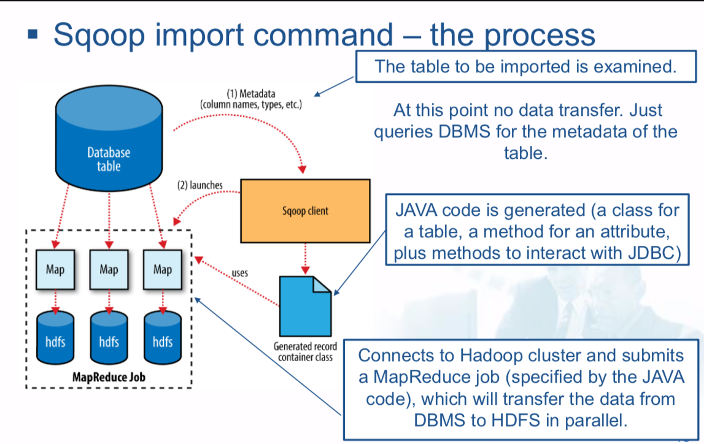
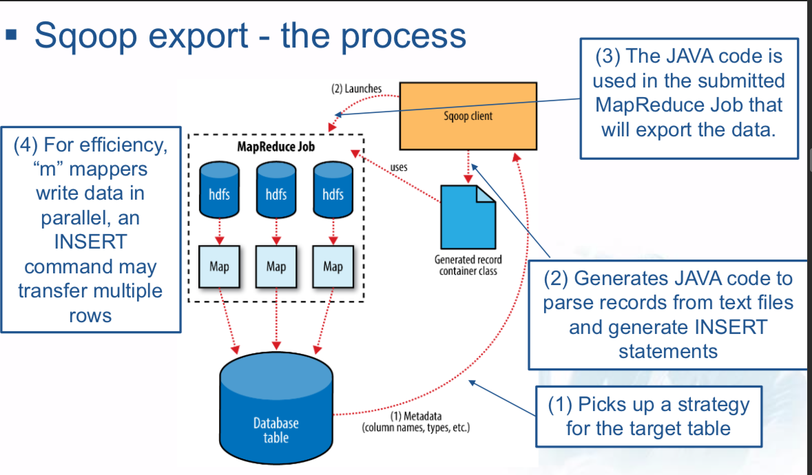
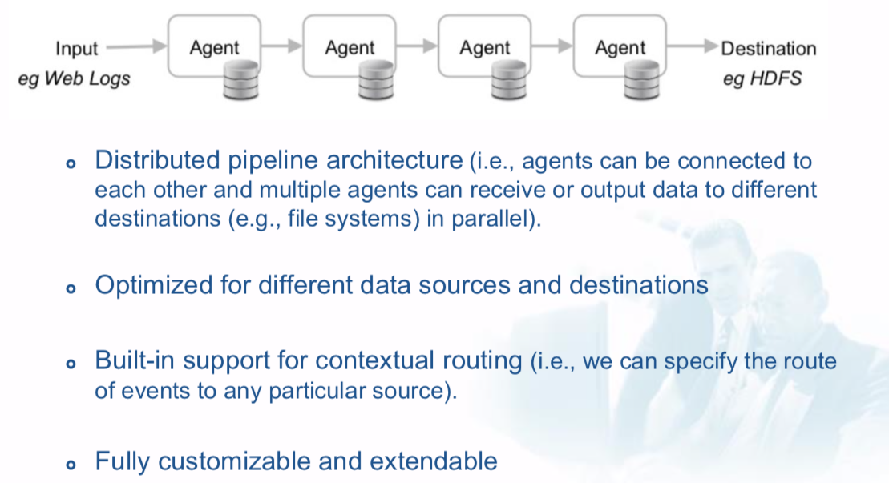
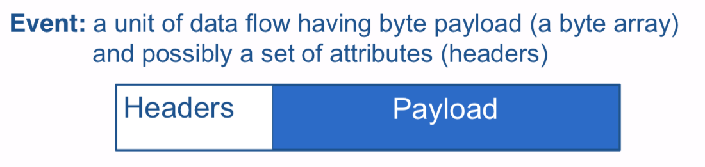
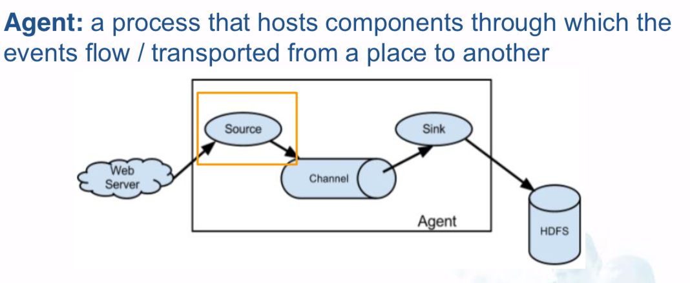
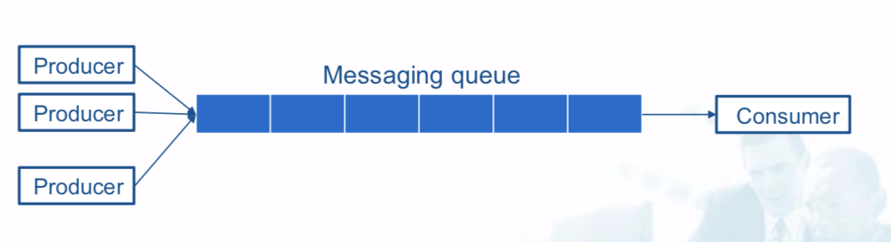

# Data Collection

## Overview


### Analytics flow for big data

1. **Data collection**: The data is collected and ingested into a big data stack,
2. **Data Preparation**: Issues required for meaningful processing are resolved,
3. **Analysis types**: The type of analysis is determined,
4. **Analysis modes**: The mode of analysis is determined,
5. **Visualizations**: The analysis results are presented to the user.


#### 1. Data Collection

#### 2. Data Preparation

- Data Cleaning: correct typos, misspelled values,
- Data Wrangling: convert data from a raw format to another,
- De-duplication: eliminate duplicate copies of data,
- Normalization: convert values to the same scales,
- Sampling: create a sample on which the analysis will be performed,
- Filtering: removes outliers or incorrect out-of-range values.

#### 3. Analysis Types

- Basic statistics
- Graph analysis
- Classification
- Regression
- Frequent pattern mining
- ...

#### 4. Analysis Modes

- **Batch mode**: results updated “infrequently” (after days or months)
  - Hadoop/MapReduce
  - Pig
  - Spark
  - Solr
- **Real-time mode**: results updated “frequently” (after few seconds)
  - Spark Streaming component
  - Storm
- **Interactive mode**: results updated “on demand” as answer to queries
  - Hive
  - Spark SQL component

#### 5. Visualizations


## Data Collection

### Data access connectors

1. Publish-subscribe messaging
2. Source-sink connectors
3. Database connectors
4. Messaging Queues
5. Custom connectors

### Apache Sqoop

- Imports data from RDBMS into HDFS,
- Exports data from HDFS back to RDBMS,
- Built-in support for RDBMS: MySQL, PostgreSQL, Oracle, SQL Server, DB and Netezza.

#### Sqoop Import



```bash
sqoop import \
--connect jdbc:mysql://mysql.example.com/sqoop \ --username sqoop \
--password sqoop \
--table visits \
--incremental append \
--check-column id \
--last-value 1
```

#### Sqoop Export



```bash
sqoop export \
--connect jdbc:mysql://mysql.example.com/sqoop \ --username sqoop \
--password sqoop \
--table cities \
--export-dir cities
```

### Apache Flume

- System for collecting, aggregating, and moving data from different sources (e.g. server logs, databases, social media, IoT devices), into a centralized (big) data store (e.g. distributed file system or NoSQL database)
- Advantages over ad-hoc solutions
  - Reliable, Scalable, High performance
  - Manageable, Customizable
  - Low-cost installation, operation and maintenance

#### Architecture




#### Event



A unit of data flow having byte payload (a byte array) and possibly a set of attributes (headers)

- Payload is opaque to Flume
- Headers
  - can be used for contextual routing (e.g., which events should be transferred first),
  - are an unordered collection (map) of string key-value pairs.
#### Agent



**Source**: receives data from data generators and transfers it to one or more channels.

- requires at least one channel to function
- specialized soruces for integration with well-known systems

**Channel**: a transient store which buffers events until they are consumed by sinks.

- a channel can work with any number of sources and sinks
- different channels offer different levels or durability (memory, file, db)

**Sink**: removes events from a channel and transmits them to their next hop destination

- different types of sinks
- requires exactly one channel to function

#### Additional Components of an Agent


- 1. **Interceptor**: Applied to source to **modify, filter, or drop events**.
- 2. **Channel processor**: When there are multiple channels, it defines policy about distributing events to the channels. **If there are interceptors, the channel selector it is applied after them, using the events that were modified by the interceptors**.
- 3. **Sink selector**: invokes one sink from a specified group of sinks (e.g., determines which of the sinks will pull events out of its channel)

### Messaging Queue

- Producers push data to the queue,
- Consumers pull the data from the queue,
- Producers and consumers do not need to be aware of each other.



#### ZeroMQ


