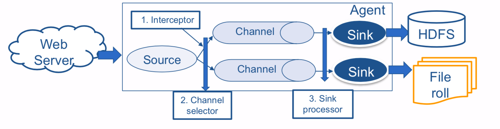

# Data Collection

## Overview


### Analytics flow for big data

1. **Data collection**: The data is collected and ingested into a big data stack,
2. **Data Preparation**: Issues required for meaningful processing are resolved,
3. **Analysis types**: The type of analysis is determined,
4. **Analysis modes**: The mode of analysis is determined,
5. **Visualizations**: The analysis results are presented to the user.


#### 1. Data Collection

#### 2. Data Preparation

- Data Cleaning: correct typos, misspelled values,
- Data Wrangling: convert data from a raw format to another,
- De-duplication: eliminate duplicate copies of data,
- Normalization: convert values to the same scales,
- Sampling: create a sample on which the analysis will be performed,
- Filtering: removes outliers or incorrect out-of-range values.

#### 3. Analysis Types

- Basic statistics
- Graph analysis
- Classification
- Regression
- Frequent pattern mining
- ...

#### 4. Analysis Modes

- **Batch mode**: results updated “infrequently” (after days or months)
  - Hadoop/MapReduce
  - Pig
  - Spark
  - Solr
- **Real-time mode**: results updated “frequently” (after few seconds)
  - Spark Streaming component
  - Storm
- **Interactive mode**: results updated “on demand” as answer to queries
  - Hive
  - Spark SQL component

#### 5. Visualizations

- **Static**: The analysis results are stored in a database (e.g., MySQL, DynamoDB, MongoDB) and displayed
- **Dynamic**: The analysis results are updated regularly and displayed (using live widgets, plots, gauges)
- **Interactive**: The analysis results are displayed on demand, based on user input


## Data Collection

### Data access connectors

tools and frameworks to **collect and ingest data** from **various sources** into big data storage & analytics frameworks

1. **Publish-subscribe messaging**

  - **Publishers** send messages to a topic managed by a broker (intermediary)
  - **Subscribers** subscribe to topics
  - **Brokers** route messages from publishers to subscribers

2. **Source-sink connectors** (Apache Flume)

  - **Source connectors** import data from another system (e.g., relational database) into a centralized data store (e.g., distributed file system)
  - **Sink connectors** export data to another system (e.g., HDFS)

3. **Database connectors** (Apache Sqoop)

  Import data from relational DBMSes into big data storage and analytics frameworks

4. **Messaging Queues** (ZeroMQ)

  - **Producers** push data to the queues
  - **Consumers** pull the data from the queues
  - Producers and consumers **do not need to be aware of each other**

5. **Custom connectors**

  Built based on the data sources and data collection requirements

### Apache Sqoop

- Imports data from RDBMS into HDFS,
- Exports data from HDFS back to RDBMS,
- Built-in support for RDBMS: MySQL, PostgreSQL, Oracle, SQL Server, DB and Netezza.

#### Sqoop Import


```bash
sqoop import \
--connect jdbc:mysql://mysql.example.com/sqoop \ --username sqoop \
--password sqoop \
--table visits \
-m 8 \
--split-by visits.id \
--incremental append \
--check-column id \
--last-value 1
```

#### Sqoop Export


```bash
sqoop export \
--connect jdbc:mysql://mysql.example.com/sqoop \ --username sqoop \
--password sqoop \
--table cities \
--export-dir cities
```

### Apache Flume

- System for collecting, aggregating, and moving data from different sources (e.g. server logs, databases, social media, IoT devices), into a centralized (big) data store (e.g. distributed file system or NoSQL database)
- Advantages over ad-hoc solutions
  - Reliable, Scalable, High performance
  - Manageable, Customizable
  - Low-cost installation, operation and maintenance

#### Architecture


#### Event


A unit of data flow having byte payload (a byte array) and possibly a set of attributes (headers)

- Payload is opaque to Flume
- Headers
  - can be used for contextual routing (e.g., which events should be transferred first),
  - are an unordered collection (map) of string key-value pairs.
#### Agent


**Source**: receives data from data generators and transfers it to one or more channels.

- requires at least one channel to function
- specialized soruces for integration with well-known systems

**Channel**: a transient store which buffers events until they are consumed by sinks.

- a channel can work with any number of sources and sinks
- different channels offer different levels or durability (memory, file, db)

**Sink**: removes events from a channel and transmits them to their next hop destination

- different types of sinks
- requires exactly one channel to function

#### Additional Components of an Agent



- 1. **Interceptor**: Applied to source to **modify, filter, or drop events**.
- 2. **Channel selector**: When there are multiple channels, it defines policy about distributing events to the channels. **If there are interceptors, the channel selector it is applied after them, using the events that were modified by the interceptors**.
- 3. **Sink selector**: invokes one sink from a specified group of sinks (e.g., determines which of the sinks will pull events out of its channel)

### Messaging Queue

- Producers push data to the queue,
- Consumers pull the data from the queue,
- Producers and consumers do not need to be aware of each other.


#### ZeroMQ

Asynchronous messaging library for distributed or concurrent applications.

Two types of sockets

1. **zmq.PUSH**

  Sends messages to downstream pipeline nodes. Messages are round-robined to all connected downstream nodes.

2. **zmq.PULL**

  Receives messages from upstream pipeline nodes. Messages are fair-queued (interleaved) from among all connected upstream nodes.

```python
import sys
import zmq
from multiprocessing import Process
import time

def worker():
    # creates a Context (needed for socket creation)
    context = zmq.Context()
    #creates socket of type zmq.PULL work_receiver.connect("tcp://127.0.0.1:5557") #connects to remote socket of ventilator
    work_receiver = context.socket(zmq.PULL)
    for task_nbr in range(10000000):
        #receives a message from the remote socket of ventilator
        message = work_receiver.recv()
    sys.exit(1)
    
def main():
    #see https://docs.python.org/2/library/multiprocessing.html#the-process-class
    #for details on multiprocessing
    Process(target=worker, args=()).start()
    context = zmq.Context()
    #creates a socket of type zmq.PUSH
    ventilator_send = context.socket(zmq.PUSH)
    ventilator_send.bind("tcp://127.0.0.1:5557")
    for num in range(10000000):
        ventilator_send.send(b"MESSAGE")

if __name__ == "__main__":
    start_time = time.time()
    main()
    end_time = time.time()
    duration = end_time - start_time
    msg_per_sec = 10000000 / duration print("Duration: %s",duration)
    print("Messages Per Second: %s", msg_per_sec)
```


