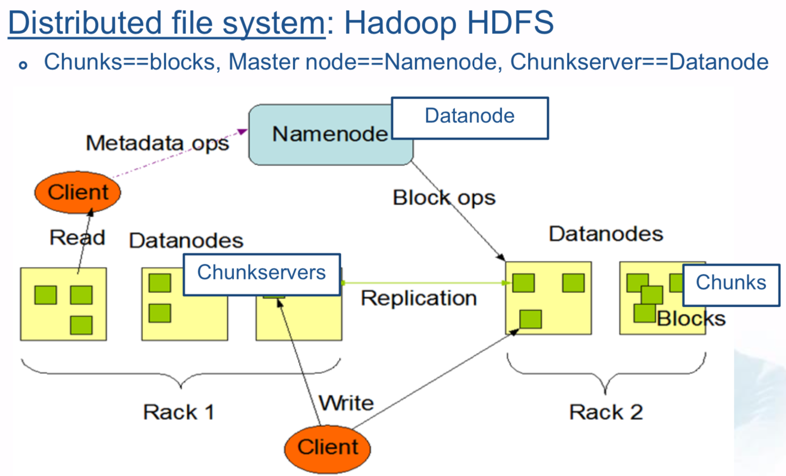
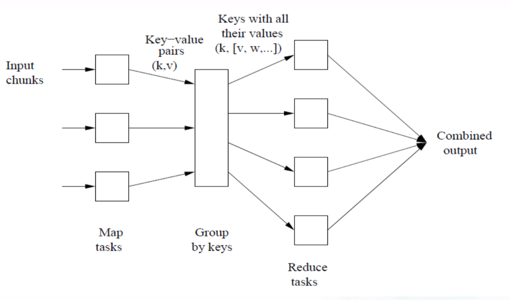
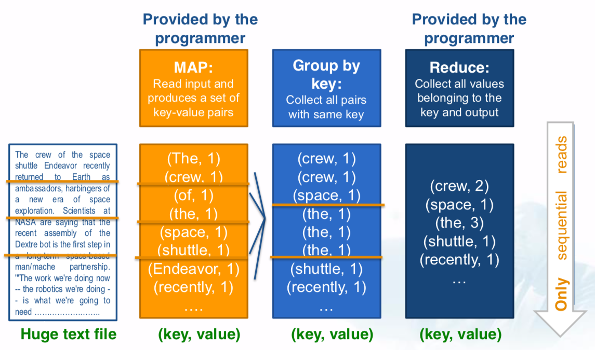

# Software Stack

## Overview

### Distributed File System

- stores large data
- provides replication
- protects against failures

Files are **divided into chunks** that are stored in chunk servers and **replicated** on different machines or racks (recovery from server or rack failures)

- Provides global file namespace
- Used when:
  - files are huge (100s of GBs to TB)
  - existing files are rarely updated
  - reads and appends are comon

### Programming Model

- performs large-scale, distributed compuations efficiently
- tolerates hardware failures

MapReduce is such a programming model / system / paradigm

## MapReduce

### Overview

### Map Task

extract something you care about

- Gets chunks from the distributed file system
- Turns chunks into key-value pairs

**Map $(k,v)\rightarrow <k', v'>^*$**

- Input: a key-value pair
- Output: a possibly empty list of key-value pairs
- One Map call for every different (k,v) pair

### Shuffle and Sort Task

- Performed by the system automatically.
- Data from all mappers are grouped by the key, split among reducers, and sorted by the key.
- Each reducer obtains all values associated with the same key.

### Reduce Task

**Reduce $(k',<v'>^*)\rightarrow <k', v''>^*$**

- Input: a key and a possibly empty list of its associated values
- Output: A possibly empty list of key-value pairs
- One Reduce function for every different key $k’$.

### Refinement: Combiner

Often a Map task will produce many pairs of the form $(k, v_1)$, $(k, v_2)$, ... for the same key $k$. Combiner can save network time by **pre-aggregating values in the mapper**.

It can only be applied to a function that is commutative and associative. (e.g., max(5, 4, 1, 2) == max(max(5, 1), max(4 ,2))). Its input & output mush be of the same type as that of the mapper.

### Refinement: Partitioner

- **Divides** data (key, value) pairs of Map tasks,
- Ensures that the **same key** (that can be output by multiple mappers) goes to the same reducer.

### Refinement: Backup Tasks

**There are slow workers**. they significantly lengthen the job completion time. When MR operation is about to complete, spawn backup copies of in-progress tasks

### Workflow

1. Input data are split into pieces and multiple instances of the program start,
2. One instance elected as master, the rest are workers. Master assigns map or reduce task(s) to an idle worker,
3. Worker with Map task processes its input, outputs key-value pairs, and passes them to the user’s map function. The pairs are buffered in memory.
4. The buffered pairs are written to local disk and partitioned into regions. The locations of pairs on disk are passed to the master.
5. When a Reducer worker is notified by the master about the locations, it reads the buffered pairs, and groups them by key (key, list-of-values)
6. The Reducer worker passes the key and values into the user’s reducer function, whose output is appended to the final output file.
7. When all Map and Reduce tasks are complete, the control returns to the user program. The program may use the output as input to another MapReduce task.

**Rule of thumb**:

M map tasks, R reduce tasks

- M >> number of nodes in the cluster
  - Improves dynamic load balancing
  - speeds up recovery from worker failures
  - Can pipeline shuffling with map execution
- Usually R << M
  - R set as small multiple of number of nodes
  - Because output is spread across R files

### Exception Handling

**What if master fails?**

MapReduce task is aborted (needs to be restarted)

**What if map worker fails?**

- Map tasks completed or in-progress at worker are reset to idle,
- Reduce workers are notified when task is rescheduled on another worker.

**What if reduce fails?**

- Only in-progress tasks are reset to idle,
- Reduce task is rescheduled to start later.

