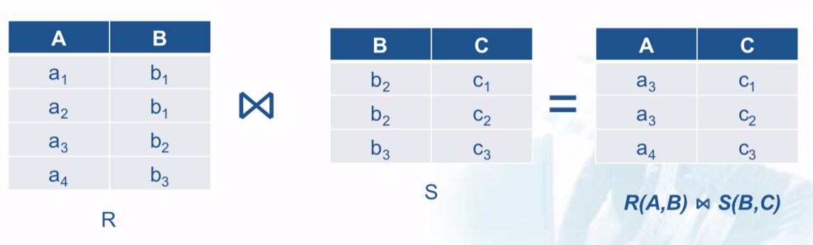

# Data Processing: MapReduce

## MapReduce Patterns

Example data: log file (Date, Time, URL, IP, visit_length)

```
2014-01-01 20:01:02 http://www.google.com 77.32.11.111 3
2014-02-02 23:01:08 http://www.google.com 77.32.11.111 7
2015-03-03 01:02:03 http://www.ibm.com 50.62.22.123 5
2014-06-06 21:02:03 http://www.cnn.com 120.62.102.124 7
```

### Numberical Summarization

**Problem 1**: Count total number of times each page is visited in 2014.

```python
from mrjob.job import MRJob

class MyJob(MRJob):
    def mapper(self, _, line):
        data = line.split()

        date = data[0].strip()
        time = data[1].strip()
        url = data[2].strip()
        ip = data[3].strip()

        year = date[0:4]
        if year == '2014':
            yield url, 1
   
    def reducer(self, key, list_of_values):
        yield key, sum(list_of_values)
        
if __name__ == '__main__':
    MyJob.run()
```

**Problem 2**: Most visited page in each month of 2014

```python
from mrjob.job import MRJob
from mrjob.step import MRStep

class MyJob(MRJob):
    def mapper1(self, _, line):
        data = line.split()

        date = data[0].strip()
        time = data[1].strip()
        url = data[2].strip()
        ip = data[3].strip()

        year = date[0:4]
        month = date[5:7]

        if year == '2014':
            # ((month, url), 1)
            yield (month, url), 1
   
    def reducer1(self, key, list_of_values):
        # (month, (count, url))
        yield key[0], (sum(list_of_values), key[1])
        
    def reducer2(self, key, list_of_values):
        yield key, max(list_of_values)
        
if __name__ == '__main__':
    MyJob.run()
```


### Filtering

**Problem**: Retrieve all page visites for the page

```python
from mrjob.job import MRJob

class MyJob(MRJob):
    def mapper(self, _, line):
        data = line.split()

        date = data[0].strip()
        time = data[1].strip()
        url = data[2].strip()
        ip = data[3].strip()
        visit_length = int(data[4].strip())

        year = date[0:4]
        month = date[5:7]
        if year == '2014' and month == '12' and url =='http://www.google.com':
            yield url, (date, time, ip, visit_length)

    # There is no reducer
        
if __name__ == '__main__':
    MyJob.run()
```


### Distinct

**Problem**: Retrieve all distinct IP addresses.

```python
from mrjob.job import MRJob

class MyJob(MRJob):
    def mapper(self, _, line):
      data = line.split()
      ip = data[3].strip()
      yield ip, None
    
    def reducer(self, key, list_of_values):
        yield key, None
        
if __name__ == '__main__':
    MyJob.run()
```

### Binning

**Problem**: Partition records of the Log file based on the quarter of 2014 in which the pages have been visited. Note quarters 1,2,3,4 are denoted with Q1, Q2, Q3, Q4.

```python
from mrjob.job import MRJob

class MyJob(MRJob):
    def mapper(self, _, line):
        data = line.split()

        date = data[0].strip()
        time = data[1].strip()
        url = data[2].strip()
        ip = data[3].strip()
        visit_length = int(data[4].strip())

        year = date[0:4]
        month = int(date[5:7])

        if year == '2014':
            if month <= 3:
                yield 'Q1', (date, time, url, ip, visit_length)
            elif month <= 6:
                yield 'Q2', (date, time, url, ip, visit_length)
            elif month <= 9:
                yield 'Q3', (date, time, url, ip, visit_length)
            else:
                yield 'Q4', (date, time, url, ip, visit_length)
    
    def reducer(self, key, list_of_values):
        yield key, None
        
if __name__ == '__main__':
    MyJob.run()
```

### Sorting

**Problem**: Sort the pages visited in 2014, with respect to their visit length in decreasing order.

```python
from mrjob.job import MRJob

class MyJob(MRJob):
    def mapper(self, _, line):
        data = line.split()

        date = data[0].strip()
        time = data[1].strip()
        url = data[2].strip()
        ip = data[3].strip()
        visit_length = int(data[4].strip())

        year = date[0:4]
        month = int(date[5:7])

        if year == '2014':
            yield None, (visit_length, (date, time, url, ip))
    
    def reducer(self, key, list_of_values):
        list_of_values=sorted(list(list_of_values), reverse=True)
        yield None, list_of_values
        
if __name__ == '__main__':
    MyJob.run()
```

### Map-Reduce Join

**Problem**: Compute the natural join $R(A,B) \Join S(B,C)$



- A Map process turns:
  - Each input tuple R(a,b) into key-value pair (b,(a,R))
  - Each input tuple S(b,c) into key-value pair (b,(c,S))
- Map processes send each key-value pair with key b to Reduce process
- Each Reduce process matches all the pairs (b,(a,R)) with all (b,(c,S)) and outputs (a,b,c).


## Measurement for MR

### Cost Measures for MR

1. **Communication cost**: **total** I/O of all process

- input file size $+$
- 2 x (sum of the sizes of all files passed from Map processes to Reduce processes)* $+$
- the sum of the output sizes of the Reduce processes.

2. **Elapsed communication cost**: **max** of I/O along any path

- the largest input + output, for any map process  $+$
- the largest input + output, for any reduce process.

### Complexity measures for MR

**Key complexity**: **Over all key-value pairs**, input or output by any Mapper or Reducer, compute

**Sequential complexity**: **Over all mappers and reducers**, sum
