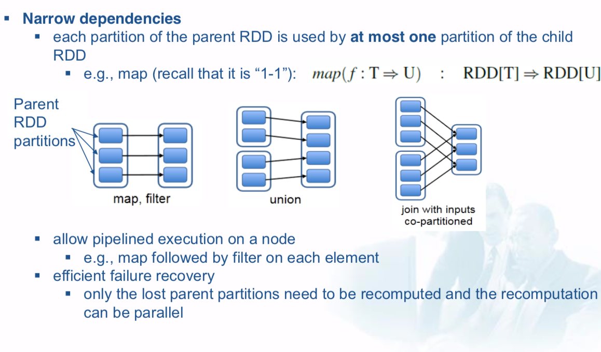
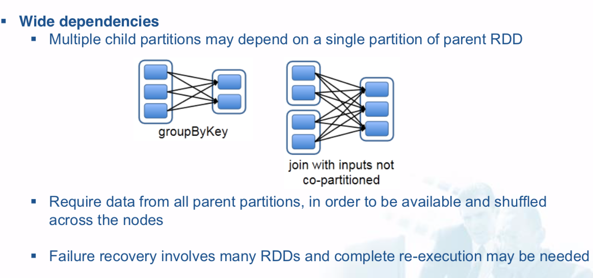
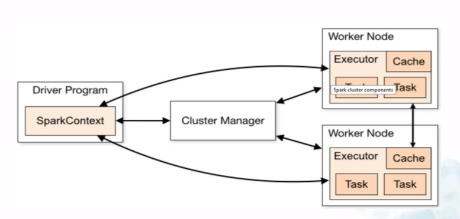
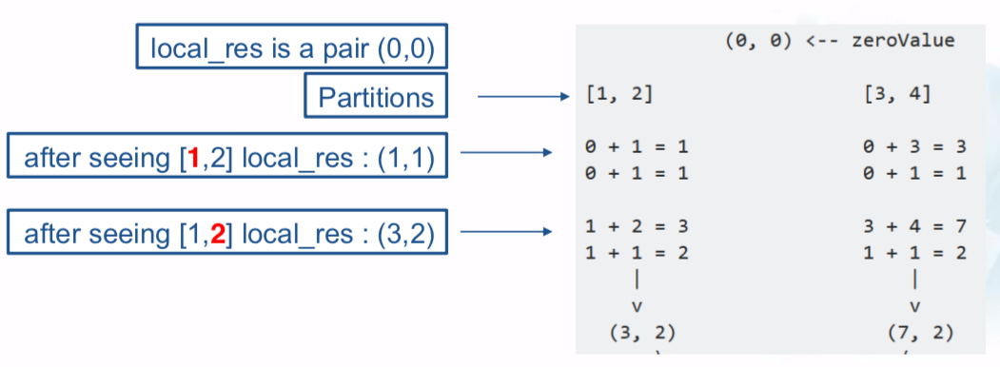
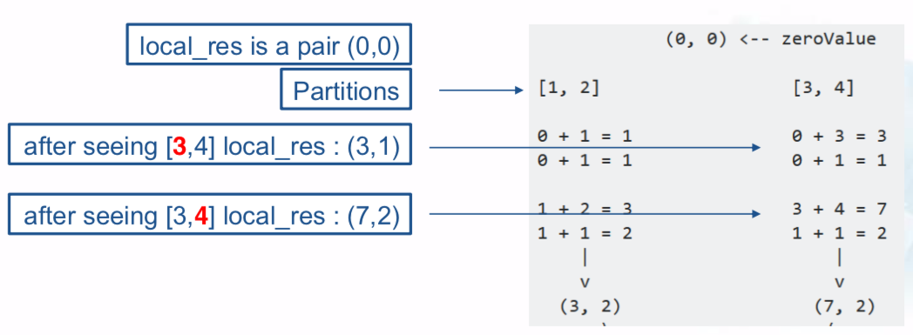
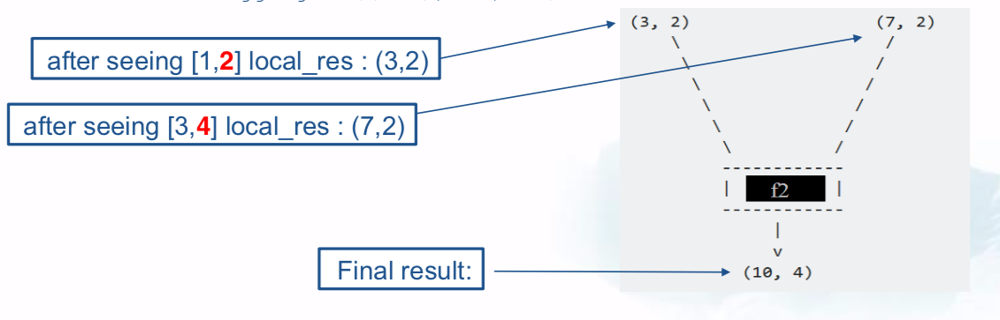

# Data Processing: Spark

## Spark

Spark is unified engine for distributed data processing. Spark extends MapReduce programming model with an abstraction that allows efficient **data reuse**.

### Drawback of MapReduce

- Map Reduce is inefficient for applications that **reuse intermediate results** across multiple computations.

  e.g., PageRank, k-means clustering

- Map Reduce is inefficient for **interactive data mining** (multiple ad-hoc queries on the same data)

  e.g., web log queries

## Overview of Resilient Distributed Datasets (RDDs)

- An RDD is a read-only, fault-tolerant collection of records that can be operated in parallel.
- An RDD is a data structure that serves as the core unit of data. User program can manipulate it, control its partitioning, make it persistent in memory.

Created through operations, called **transformations**, on

- data in stable storage
- Other RDDs

Manipulated through **actions**, i.e., operations that

- return a value to the application, or
- export data to a storage system

### Lazy Evaluation

Spark executes only **after seeing the first action**, and it lazy evaluates transformations (e.g., spark.textFile(),lines.filter())

**Benefits of Lazy evaluation**:

  1. Spark can optimize the required calculations by grouping operations together.
  2. Spark recovers from failures and slow workers.

### Advantages of RDD

1. RDDs provide efficient fault tolerance
  - They can be recovered using lineage
  - Only lost partitions need to be recomputed (and this can be done in parallel)
2. Spark can run backup copies of slow tasks (e.g., to address issues with slow nodes as in MapReduce) without accessing the same memory
3. Runtime can schedule tasks based on data locality to improve performance
4. RDDs degrade gracefully when there is not enough memory to store them. Partitions that do not fit in RAM stored on disk.

### Aplications for RDD

**Suitable** for batch applications that perform the same operation to the entire dataset.

- RDDs remember each transformation as one step in a lineage graph
- RDDs can recover lost partitions efficiently

**Not suitable** for applications that make asynchronous fine-grained updates to shared state.

- e.g., storage system for a web application in which many users update values on the same table

### RDD vs. Distributed Shared Memory (DSM)

DSM: a global address space that applications can read and write to in arbitrary locations.

RDDs created by coarse-grained transformations (applied to the entire dataset) but reads can be fine-grained (read from a specific location).

DSM allows fine-grained writes and reads.

Thus, RDDs restricted to applications performing bulk writes.

### Representing Dependencies





### Spark Architecture



- **Cluster Manager**: Allocates resources across applications
- **Driver Program**
  - **SparkContext** connects to the cluster manager, acquires executors, sends application code and tasks to executors
- **Executor**: process that performs computations and stores data
- **Task**: a unit of work that will be sent to an executor

## pySpark

### Parallelized collections

- Created by the parallelize method of sc on an existing iterable or collection **d**
- The elements of **d** are copied to form a distributed dataset that can be operated on in parallel

### count

Returns the number of elements in this RDD

### filter

### map

### flatMap

### collect

### sample

Output a sample of size fraction\*100% of the data, with or without replacement, using a given random number generator seed


### Reduce

#### Fold

Same as reduce but with a first identity (“zero”) argument of the type we want to return

### Aggregate

Like fold, but aggregates the results in each partition, using a function f1, and then combines the results for all partitions using a function f2 

```python
rdd = sc.parallelize([1,2,3,4],2)
f1=(lambda local_res, list_elem: (local_res[0]+list_elem, local_res[1]+1))
f2=(lambda local_resA, local_resB:(local_resA[0]+ local_resB[0],local_resA[1]+local_resB[1]))
# loacl_res is (0, 0) at the begining
sum = rdd.aggregate((0.0), f1, f2)
```







### Accumulators

Variables that are only “added” to through an associative and commutative operation and can therefore be efficiently supported in parallel.

```python
accum = sc.acumulator(0)
sc.parallelize([1, 2, 3, 4,5]).foreach(lambda x: accum.add(x))
```


