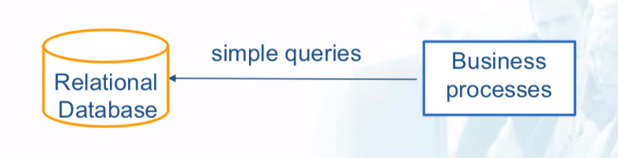
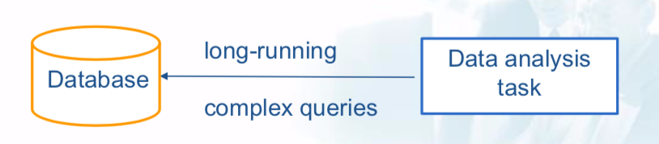

# NoSQL Databases

## Introduction

### Online Transaction Processing (OLTP) systems

- **Store**: structured data, in Relational Databases
- ** Queries**: simple (insert, delete, update operations)
- **Relation to Big Data**: Big Data analysis results can augment OLTP data

### Online Analytical Processing (OLAP) systems

- **Store**: data in databases that are optimized for analytics
- ** Queries**: are long and complex - part of analytic tasks (business intelligence, data mining, machine learning)
- **Relation to Big Data**: serve as sources and sinks

**What are the characteristics of Not only SQL (NoSQL) databases?**

- Non-relational databases
- Highly-scalable and fault-tolerant
- Designed for large, distributed, semi-structured and unstructured data (usually no fixed schema nor joins)
- Mostly for queries, few asynchronous inserts & updates
- Accessible through API-based query interface and data- specific query languages

RECALL: **ACID**

- **Atomicity**: all operations succeed or fail (no partial transactions)
- **Consistency**: all added data needs to conform to constraints
- **Isolation**: concurrent and sequential execution of transactions yield the same result
- **Durability**: a committed transaction cannot be rolled back

**CAP theorem**

**C**onsistency, **A**vailability, **P**artition tolerance

In any distributed system, you have to partition. That leaves either consistency or availability to choose from.

*补充NoSQL适合big data的3v*

### Characteristics of NoSQL databases: BASE

- **Basically Available**: will always acknowledge a client’s request (answer or success/failure notification)
- **Soft state**: may be inconsistent when data are read
- **Eventually consistent**: reads after write may not return consistent results, but they will once changes propagated to all nodes

### RDBMS vs. NoSQL

|   |RDBMS|NoSQL|
|---|---|---|
|Elastic Scaling|scale up: bigger load , bigger server|scale out: distribute data across multiple hosts seamlessly|
|Big Data|Huge increase in data RDBMS: capacity and constraints of data volumes at its limits|designed for big data|
|DBA Specialists|require highly trained expert to monitor DB|require less management, automatic repair and simpler data models|
|Flexible data models|need careful schema change management|not need complicated schema management|
|Economic Cost|rely on expensive proprietary servers to manage data|clusters of cheap commodity servers to manage the data and transaction volumes|
|Support|RDBMS vendors provide a high level of support to clients|open source projects with startups supporting them|
|Maturity|stable and dependable|still implementing their basic feature set|
|Lack of Expertise|Whole workforce of trained and seasoned RDMS developers|Still recruiting developers to the NoSQL camp|
|Analytics and Business Intelligence|designed to address this niche|designed to meet the needs of a Web 2.0 application - not designed for ad hoc data queries|

## NoSQL

### 1. Key/value

- Store key-value pairs
- Keys are unique
- The values are only retrieved via keys and are opaque to the database
- Key-value pairs are organized into collections (a.k.a buckets)
- Data are partitioned across nodes by keys
- The partition for a key is determined by hashing the key

**Pros**:

### 2. Document

- Store documents in a semi-structured form
- A document is a nested structure in JSON or XML format

### 3. Column-family

- They store columns. Each column has a name and value.
- Group related columns in a row
- A row does not necessarily have fixed schema or number of columns

### 4. Graph

- Store graph-structured data
- Optimized for representing connections
- Designed to allow efficient queries for finding interconnected nodes based on node and/or edge attributes

## MongoDB

*补充MongoDB细节*

