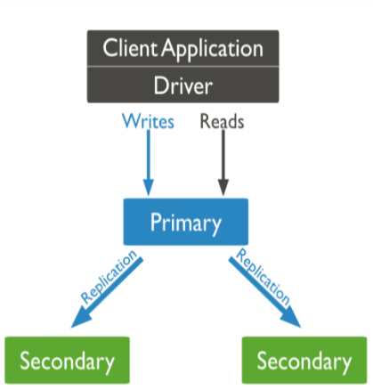
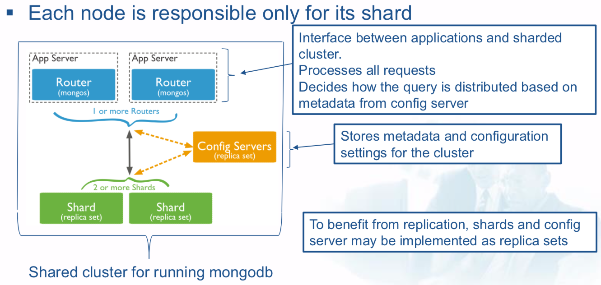

# NoSQL Databases

## Introduction

### Online Transaction Processing (OLTP) systems

- **Store**: structured data, in Relational Databases
- **Queries**: simple (insert, delete, update operations)
- **Relation to Big Data**: Big Data analysis results can augment OLTP data


### Online Analytical Processing (OLAP) systems

- **Store**: data in databases that are optimized for analytics
- **Queries**: are long and complex - part of analytic tasks (business intelligence, data mining, machine learning)
- **Relation to Big Data**: serve as sources and sinks


**What are the characteristics of Not only SQL (NoSQL) databases?**

- Non-relational databases
- Highly-scalable and fault-tolerant
- Designed for large, distributed, semi-structured and unstructured data (usually no fixed schema nor joins)
- Mostly for queries, few asynchronous inserts & updates
- Accessible through API-based query interface and data- specific query languages


RECALL: **ACID**

- **Atomicity**: all operations succeed or fail (no partial transactions)
- **Consistency**: all added data needs to conform to constraints
- **Isolation**: concurrent and sequential execution of transactions yield the same result
- **Durability**: a committed transaction cannot be rolled back


**CAP theorem**

**C**onsistency, **A**vailability, **P**artition tolerance

In any distributed system, you have to partition. That leaves either consistency or availability to choose from.

### Characteristics of NoSQL databases: BASE

- **Basically Available**: will always acknowledge a client’s request (answer or success/failure notification)
- **Soft state**: may be inconsistent when data are read
- **Eventually consistent**: reads after write may not return consistent results, but they will once changes propagated to all nodes

### NoSQL and 3Vs of Big Data

- **Volume**
  - NoSQL databases allow scaling out (adding more nodes to a commodity server)

- **Velocity**
  - Fast writes uing schema-on-read (data are applied to a schema as they go out of the database)
  - Low write latency (adding nodes decreases latency)

- **Variety**
  - Can store semi-structured and unstructured data, schema is loose or non-existent

### RDBMS vs. NoSQL

|   |RDBMS|NoSQL|
|---|---|---|
|Elastic Scaling|scale up: bigger load , bigger server|scale out: distribute data across multiple hosts seamlessly|
|Big Data|Huge increase in data RDBMS: capacity and constraints of data volumes at its limits|designed for big data|
|DBA Specialists|require highly trained expert to monitor DB|require less management, automatic repair and simpler data models|
|Flexible data models|need careful schema change management|not need complicated schema management|
|Economic Cost|rely on expensive proprietary servers to manage data|clusters of cheap commodity servers to manage the data and transaction volumes|
|Support|RDBMS vendors provide a high level of support to clients|open source projects with startups supporting them|
|Maturity|stable and dependable|still implementing their basic feature set|
|Lack of Expertise|Whole workforce of trained and seasoned RDMS developers|Still recruiting developers to the NoSQL camp|
|Analytics and Business Intelligence|designed to address this niche|designed to meet the needs of a Web 2.0 application - not designed for ad hoc data queries|

## NoSQL

### 1. Key/value Databases

- Store key-value pairs
- Keys are unique
- The values are only retrieved via keys and are opaque to the database
- Key-value pairs are organized into collections (a.k.a buckets)
- Data are partitioned across nodes by keys
- The partition for a key is determined by hashing the key

**Pros**:

- very fast
- simple model
- able to scale horizontally

**Cons**:

- many data structures (objects) can't be easily modeled as key value pairs

**Suitable when**:

- Unstructured data
- Fast read/writes
- Key suffices for identifying value
- No dependences among values
- Simple insert/delete/select operations

**Unsuitable when**:

- Operations (search, filter, update) on individual attributes of the value
- Operations on multiple keys in a single transaction

### 2. Document Databases

- Store documents in a semi-structured form
- A document is a nested structure in JSON or XML format

**Suitable when**:

- Semi-structured data with flat or nested schema
- Search on different values of document
- Updates on subsets of values
- CRUD operations (Create, Read, Update, Delete)
- Schema changes are likely

**Unsuitable when**:

- Binary data
- Updates on multiple documents in a single transaction
- Joins between multiple documents

### 3. Column-family Databases

- They store columns. Each column has a name and value.
- Group related columns in a row
- A row does not necessarily have fixed schema or number of columns

**Suitable when**:

- Data has tabular structure with many columns and sparsely populated rows (i.e., high-dimensional matrix with many 0s)
- Columns are interrelated and accessed together often
- OLAP
- Realtime random read-write is needed
- Insert/select/update/delete operations

**Unsuitable when**:

- Joins
- ACID support is needed
- Binary data
- SQL-compliant queries
- Frequently changing query patterns that lead to column restructuring

### 4. Graph Databases

- Store graph-structured data
- Optimized for representing connections
- Designed to allow efficient queries for finding interconnected nodes based on node and/or edge attributes

**Suitable when**:

- Data comprised of interconnected entities
- Queries are based on entity relationships
  - Finding groups of interconnected entities
  - Finding distances between entities

**Unsuitable when**:

- Joins
- ACID support is needed
- Binary data
- SQL-compliant queries
- Frequently changing query patterns that lead to column restructuring

**Aplications**

- Social
- Recoomendation
- Geo

## MongoDB

### Overview

- **A document database**
- **Hash-based**
  - Stores hashes (system-assigned id) with keys and values for each document
- **Dynamic shcema**
  - No Data Definition Language
  - Application tracks the schema and mapping
- Uses **BSON** (Binary JSON) format
- **APIs** for many Languages


### CRUD

#### Create

```javascript
db.products.insert({ _id:10, item: "box", qty: 20 })
```

#### Read

```javascript
db.products.update(*****)
```

#### Update

```javascript
db.products.find( { qty: { $gt: 4 } } )
```

#### Delete

```javascript
db.products.remove( {“item”:”box”} )
```


### Replication

Multiple replicas (dataset copies) are stored. Provides scalability (distributed operations), availability (due to 

redundancy), and fault tolerance (automatic failover).

**Replica set**: group of <=50 mongod instances that contain the same copy of the dataset




### Sharding

Sharding is the process of horizontally partitioning the dataset into parts (shards) that are distributed across multiple nodes



#### Benefits

1. **Efficient reads and writes**: They are distributed across the shards.
  - More shards, higher efficiency
2. **Storage capacity**: Each shard has a part of the dataset
  - More shards, increased capacity
3. **High availability**: Partial read / write operations performed if shards are unavailable. Reads or writes directed at the available shards can still succeed.
  - More shards, less chance of a shard to be unavailable


### Index Support

B+ tree indices, GeoSpatial indices, text indices


### Fast in-place updates

In-place updates are **fast** because the database does not have to allocate and write a full new copy of the object.


### MapReduce functionality


