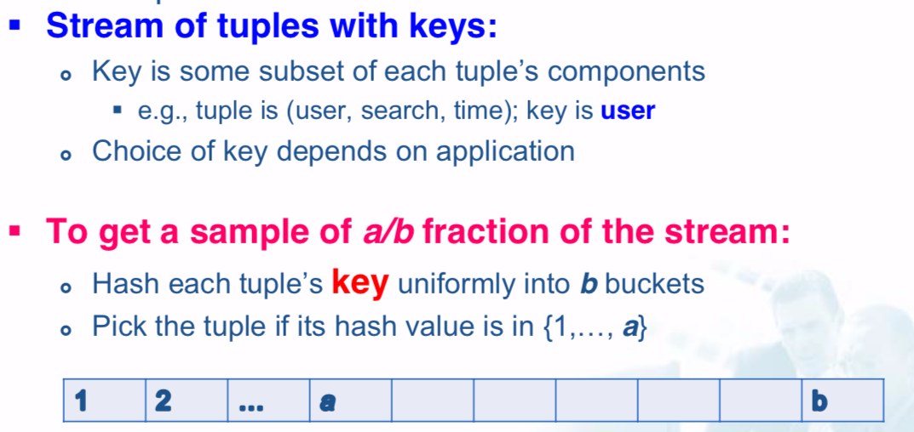
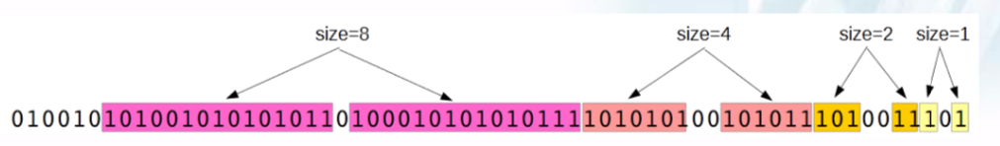
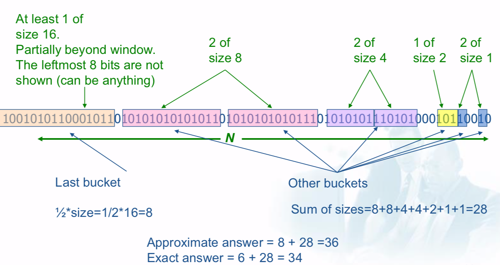
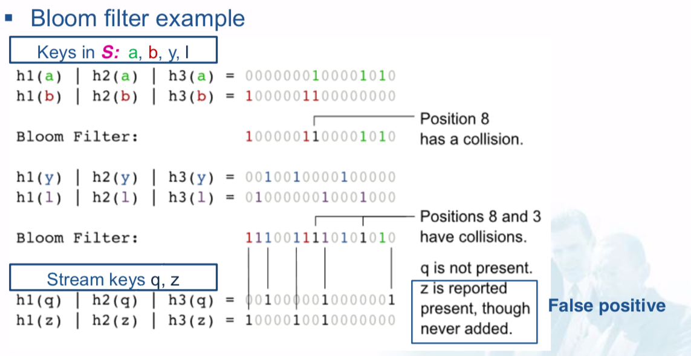
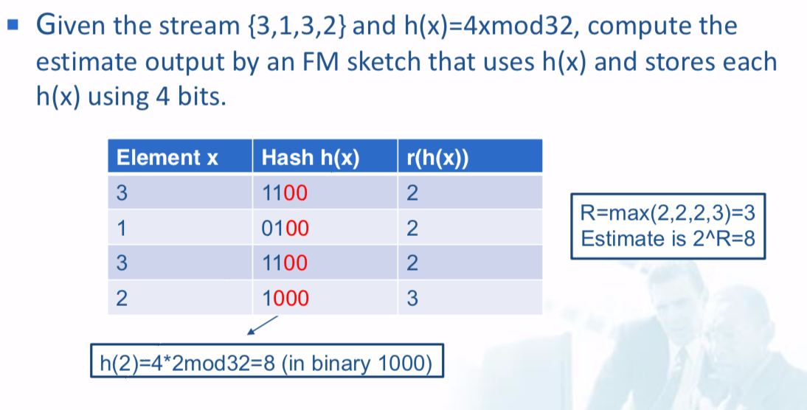
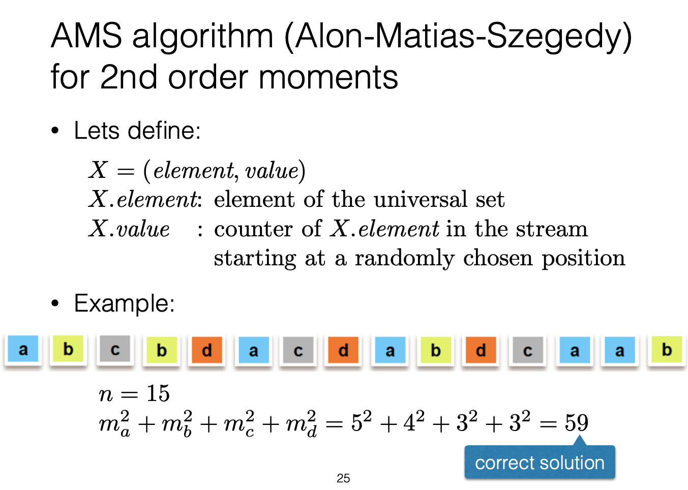
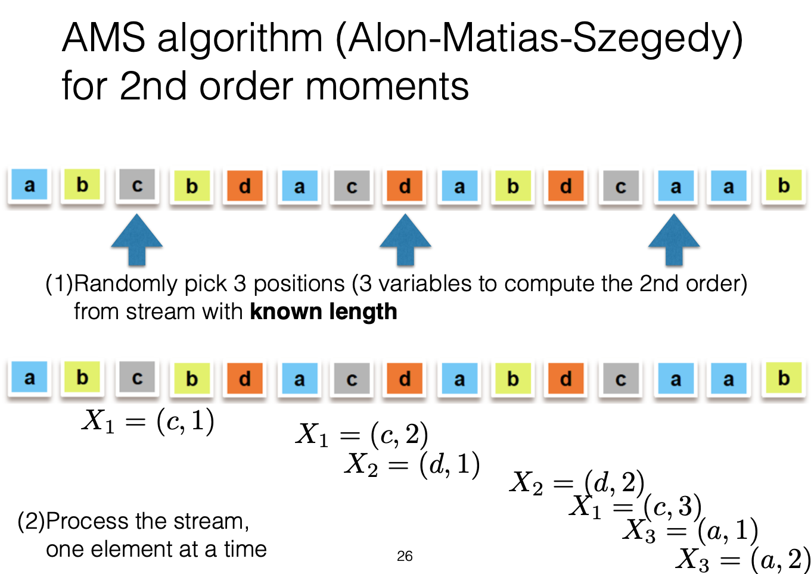
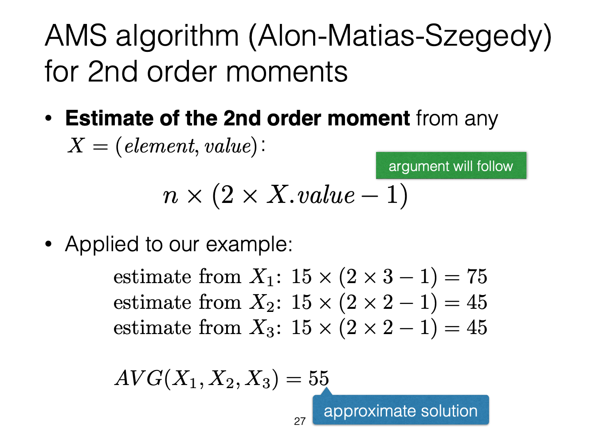

# Data Streams

## Overview

### Data Stream

An ordered and potentially infinite sequence of elements <e1, e2, e3...>

### Properties of data streams

1. Potentially infinite
  - Transient (stream might not be realized on disk)
  - Single pass over the data
  - Only summaries can be stored
  - Real-time processing (in main memory)
2. Data streams are not static
  - Incremental updates
  - Concept drift
  - Forgetting old data
3. Temporal order may be important

## Sampling from data stream

## Queries over a (long) sliding window

Many queries are about a **window containing** the **N most recent** elements.

### DGIM method

#### Rules for representing a stream with buckets

- The right end of a bucket is always an 1
- Every 1 is in a bucket
- No position is in >1 buckets
- There are one or two buckets of any given size, up to some maximum size
- All sizes must be a power of 2
- Buckets cannot decrease in size as we move from left

#### To estimate the number of 1s in the most recent N bits:

1. Sum the sizes of all buckets but the last (leftmost)
2. Add half the size of the last bucket

## Filtering a data stream: Bloom filters

1. Create a bit array B of n bits, initially all 0
2. Choose k hash functions $h_1, ..., h_k$ with range $k \in [0, n)$
3. Hash each member of $s \in S$
  - use k hash functions, $h_i(s), i \in [1,k]$, which maps into random numbers uniform in [1, n] (need modulo n if the hash function outputs larger numbers)\
  - set the elements $B[h_1(s), ..., B[h_k(s)]$ to 1
4. When a stream element with key y arrives
  - use k hash functions
  - if $B[h_1(s), ..., B[h_k(s)]$ are all 1, output y
  - else discard y

## Counting distinct elements: Flajolet-Martin

### Problem

Data stream consists of many elements chosen from a set of size N. Maintain a count of the number of **distinct elements seen so far**.

## Estimation moments: AMS method

