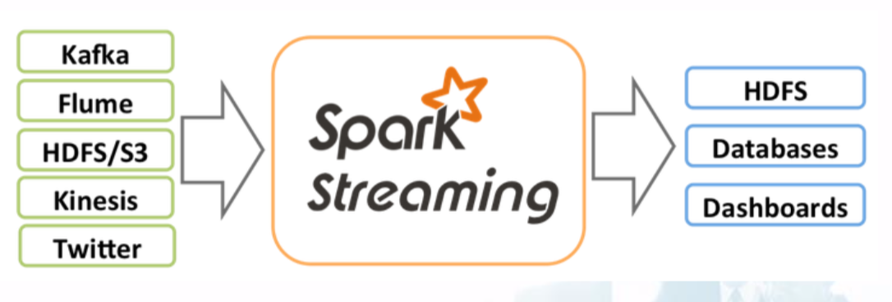

# Spark Streaming

## Overview

Spark streaming is an extension of the core Spark API that enables.

Data size calls for a very large cluster environment, but:

1. More cluster nodes $\rightarrow$ more faults are likely
2. More cluster nodes $\rightarrow$ slow nodes are likely

