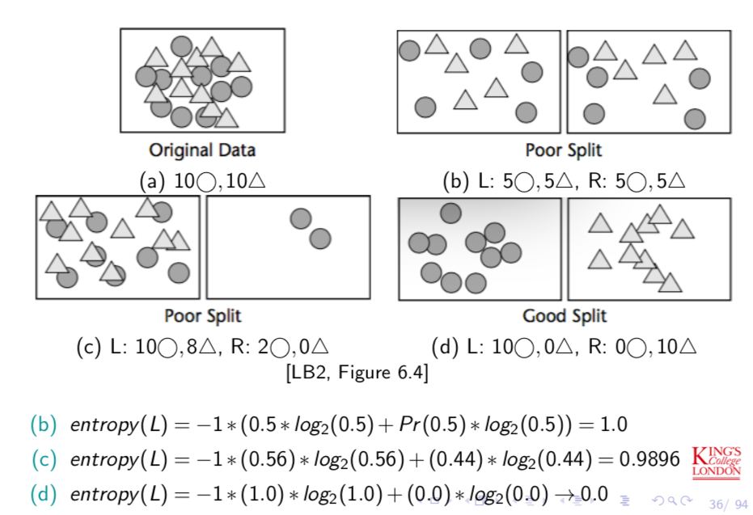
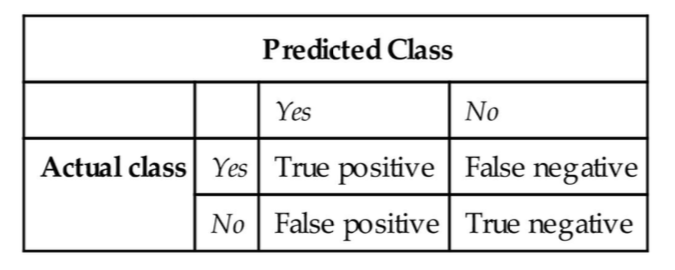
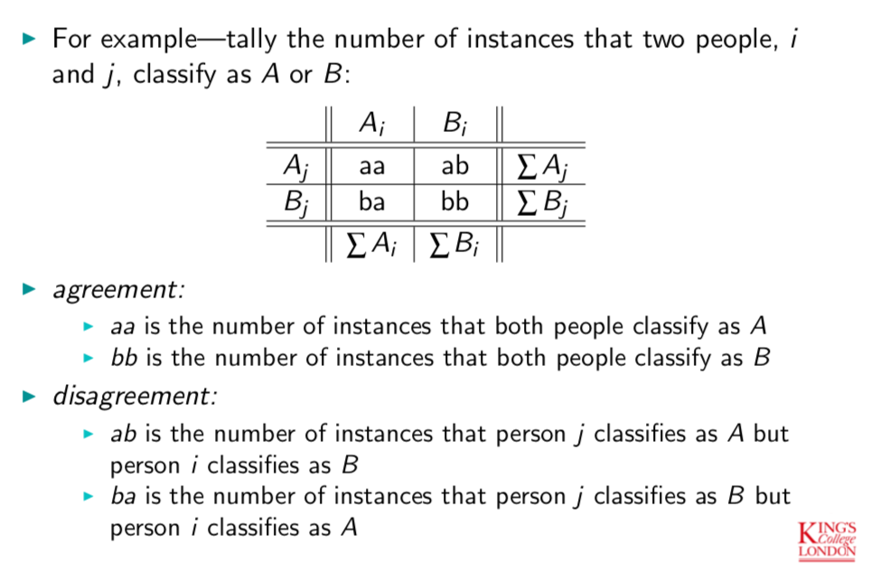
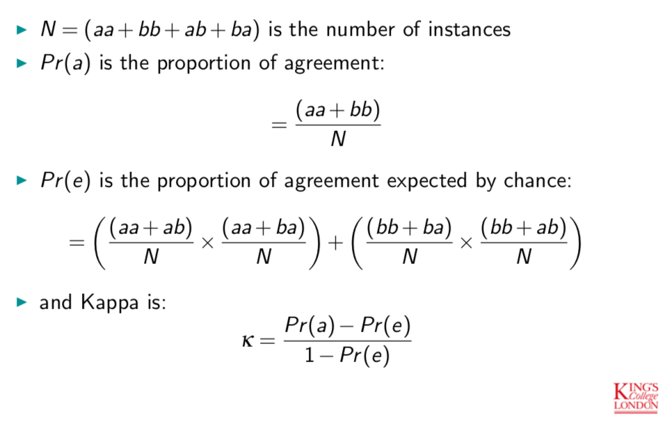
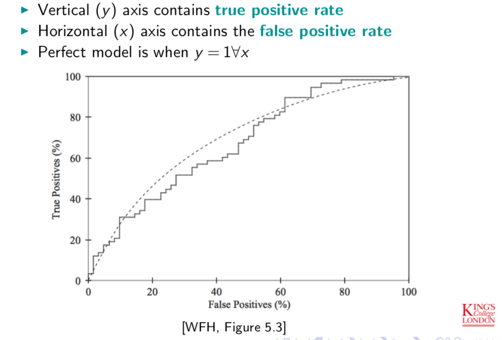

# Classification

## Overview

We want to build a model of our data that we can use to predict things about new, unseen data.

If each instance in the training set (our existing data) already has a **label** or a **class**, then this process is referred to as **supervised learning**.

Our goal is to find a rule or a function or a concept definition, based on the existing data set.

We score the model for each instance by determining whether the predicted label ($$\hat{y}$$) matches the observed label ($$y$$) and incrementing the score if it does:

```python
if y_hat == y:
    score += 1
```

We compute the **error rate** for the model by scoring each instance in the data set and then dividing by the total number of instances (M) and subtracting from 1:
$$
error\ rate = 1 - \frac{\sum_{i=1}^{M}score_i}{M}
$$


## Classification Models

### Constructing Rules and Covering Rules

**1R (or 1-rule)**

one-level decision tree that tests one attribute

**Covering Rules**

Start with constructing a simple rule that appears to cover initial examples in the training set, and then add to the rule to cover more examples that fall into the class which the rule is attempting to cover.

### Decision Trees

A **decision tree** is a hierarchical collection of rules that describe ways to partition instances into groups.

A measure of a potential split is the **purity** of the target attribute in the children nodes:

- **low purity**: the distribution of the target attribute in the children nodes is similar to the parent node,
- **high purity**: members of a single class predominate.


When to **stop splitting** (growing the tree)?

- There are no more nodes left which increase the purity of any node’s resulting children.
- The number of instances per nodes reaches a pre-set lower bound.
- The **depth** of the tree reaches a limit.


Metrics for **representing purity** include:

##### (a) Gini measure or coefficient

Gives the **probability** that two items at random from the same population are in the same class. We maximise the Gini measure of a split in the tree

$$
gini(node) = \sum_{c=1}^{C}Pr(c|node)^2
$$


##### (b) Entropy

**Entropy** is a measure of how disorganised a system is.

**Information Gain = Entropy Reduction**

- If a leaf is entirely pure, then the classes in the leaf can be described efficiently (short message)
- If a leaf is not pure, then more information is required to
describe the classes in the leaf

$$
entropy(node) = -1* \sum_{c=1}^{C}Pr(c|node)*\log_2(Pr(c|node))
$$



##### (c) $\chi^2$ (chi-square)

The higher the value of the $\chi^2$ statistic, the less likely this is a chance split.

In other words, high values of $\chi^2$ means subsets have significantly different distributions.

For a child node, the $\chi^2$ value is the sum of squares of the difference between **expected** and **observed** frequencies of the target attribute.

$$
\frac{(100-100)^2}{100} = 0\\
\frac{(100-50)^2}{100} = 25
$$

􏰀 $\chi^2$ grows as the size of the data set grows (not always between 0 and 1 like Gini and Entropy).

#### Algorithms

##### (a) CART
##### (b) ID3
##### (c) C4.5

#### Other variants:

1. Random Forest
2. Gradient Boosting Tree

### Logistic Regression

TODO


### Naive Bayes

This method is called **Naive Bayes** because it assumes **independence**.

### Perceptrons

TODO


### Neural Networks

TODO


## Evaluation

### Overview

The **error rate** is the proportion of errors over all instances:
$$
error\ rate = \frac{incorrect}{correct + incorrect}
$$

**Resubstitution error** is the error rate on **training data**. It is still useful information, even if it’s not a good predictor of the error rate on independent data.

The **test set** is considered a valid independent data set for evaluation because it was not used to train the classifier.

**Holdout** refers to the amount of data set aside for testing.

When there are plenty of instances, split them into 2 or 3 independent sets:

1. **Training set**: used to learn classification rules
2. **Validation set**: used to optimise classification parameters or select a classifier; not always used
3. **Test set**: used to evaluate classification rules

**Stratification** is the process of randomly sampling a data set to create training and test sets that each contain proper representations of each class. This can also be called **stratified holdout** (which refers to the creation of the test set).

**Cross-validation** is the process of partitioning the data into **N folds** (partitions or subsets).

**Tenfold cross-validation**: With N−fold cross-validation, the learning process is repeated
N times, once for each of the N training/test set combinations.

**Leave-one-out cross-validation**: An alternative to N-fold cross-validation where N is the
number of instances in the data set.

**Bootstrap**: It refers to the process of sampling with **replacement**. It is useful when there is not very much data available.

### Confusion Matrix



#### 1. True Positive Rate

The **true positive rate** is the proportion of instances that actually do belong to the class that were correctly identified.

$$
TP\ rate = \frac{TP}{TP + FN}
$$

#### 2. False Positive Rate

The **false positive rate** is the proportion of instances that actually do not belong to the class that were incorrectly identified.

$$
FP\ rate = \frac{FP}{TN + FP}
$$

#### 3. Overall Success Rate

$$
overall\ success\ rate = \frac{TP + TN}{TP + TN + FP + FN}
$$

#### 4. Error Rate

$$
error\ rate = 1 - overall\ success\ rate = 1-\frac{TP+TN}{TP+TN+FP+FN}
$$

#### 5. Precision (How right are we?)

$$
precision = \frac{TP}{TP + FP}
$$

#### 6. Recall (How complete are we?)

$$
recall = \frac{TP}{TP + FN}
$$

#### 7. F-Measure (F-Score)

$$
\frac{1}{F1\ Score} = \frac{1}{2}*\frac{1}{Precision}*\frac{1}{Recall}\\
F1\ Score = \frac{2\times Precision\times Recall}{Precision + Recall}
$$

### Cohen's Kappa

The Kappa statistic [Cohen, 1960] can be used to measure the agreement between two outcomes, especially when expressed as confusion matrices.

$$
\kappa = \frac{Pr(a)- Pr(e)}{1 - Pr(e)}
$$

- $Pr(a)$ is the proportion of agreement
- $Pr(e)$ is the proportion of agreement expected by chance
- $1−Pr(e)$ is the proportion for which a hypothesis of “no association” would predict disagreement





### Lift

与之前的模型相比（e.g. 随机猜）能有多少提升

### Receiver Operating Characteristic (ROC)

**ROC** is a term used in signal detection to characterise the trade-off between **hit rate (True Positive Rate)** and **false alarm (False Positive Rate)** rate over a channel.

Typically we measure the **Area Under the Curve (AUC)** of **ROC**. If AUC of ROC = 1.0, then the model is perfect.

