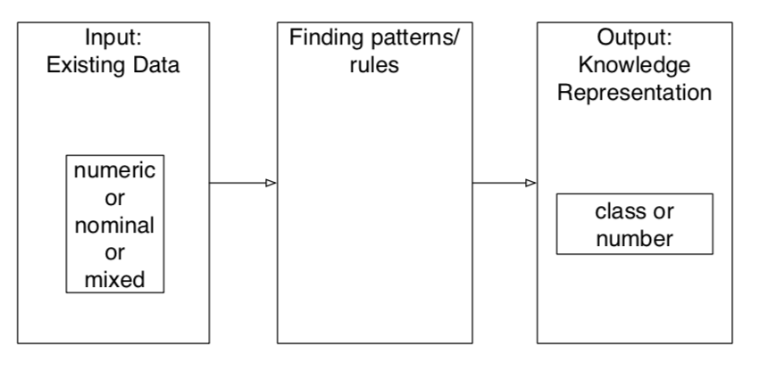

# Modelling

## Overview

A **model** is an abstract representation of a real-world process or artefact. We use **estimation** procedures to find appropriate values for $ω$ (parameters), depending on what we are aiming to model.

### Predictive Modelling

the goal is to devise a model that predicts future data.

e.g., classification and regression

### Descriptive Modelling

the goal is to devise a model of known data

e.g., clustering

### Parametric Models

A **parametric** model is appropriate if we make **assumptions** about the distribution of the **population** from which the data set (considered a sample or subset of the population) is drawn.

**Mahalanobis distance**:
a scalar indicating the distance between a data point $\chi$ and the mean $\mu$:
$$
(\chi-\mu)^T\Sigma^{-1}(\chi-\mu)
$$

which is essentially a method for computing the Euclidean distance between the mean, $\mu$, in N-dimensional space (i.e., for N-length vector $\chi$)

## Mixture Models

### Introduction

**Mixture Models** are comprised of **linear components** of simple distributions.

Data is often **heterogeneous**, containing multiple subgroups or sub-populations of a larger data set. **Mixture Models** are comprised of linear components of simple distributions

General form of a mixture distribution: 
$$
f(\chi) = \sum_{k=1}^{K}\pi_kf_k(\chi; \omega_k)
$$
where there are K components (each is k)

- $f_k(\chi;\omega)$ is the distribution for component k
- 􏰀$\omega_k$ are the parameters for component k
- $\pi_k$ is the weighting of component k in the mixture, $0 \leq \pi_k \leq 1$, i.e., the probability that a randomly chosen data point was generated by component k
- all $\pi_k$’s sum to 1

### Gaussian Mixture Models

A **Gaussian Mixture Model (GMM)** is a probabilistic version of K-Means clustering.

A GMM can be represented as:
$$
Pr(\chi_j) = \sum_{k=1}^{K}Pr(C_k)Pr(\chi_j|C_k)
$$

- $\chi_j$ represents one observation (instance),
- $C_k$ represents the component of the mixture model, where there are k components.

We use the **Expectation-Maximization (E-M)** algorithm to find the probability distribution of each GMM component.

- **Expectation**: We have to learn which component Ck each observation (in χ) most likely belongs to.
- **Maximization**: And we have to learn the parameters (mean and standard deviation) for that component.

## Instance-based Models

### Overview

### Memory Based Reasoning

- First identify similar cases (instances)
- Then apply knowledge of those cases (instances)

Sample applications:

- Fraud detection – Is a new case similar to previous fraud cases?
- Medical treatment – What treatment plans have had positive outcomes for similar patients
- Customer response prediction – Is a new customer similar to customers who responded positively to an offer?

### Nearest Neighbours

**kD-tree**

### Collaborative Filtering