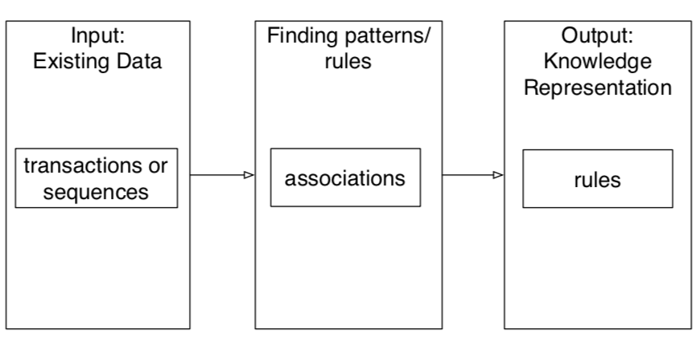
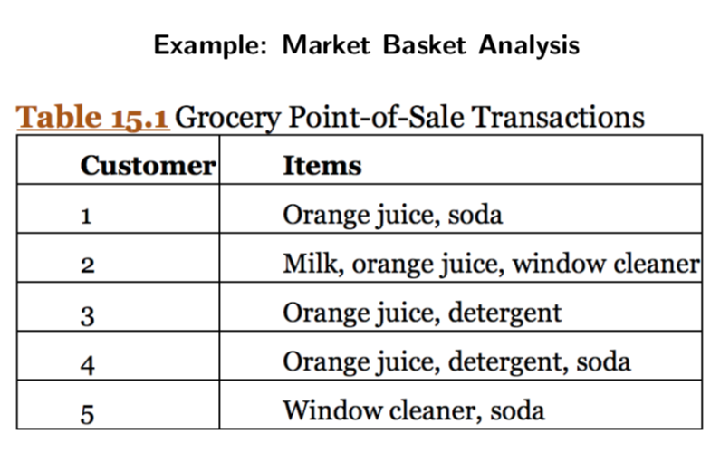
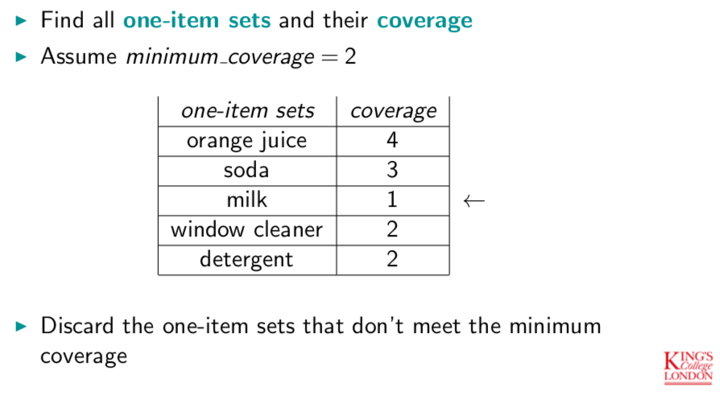
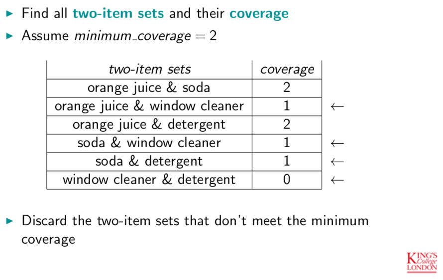
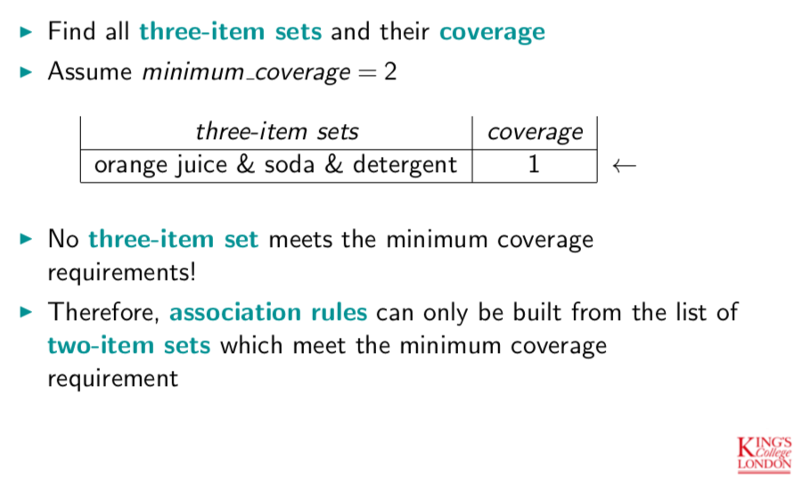
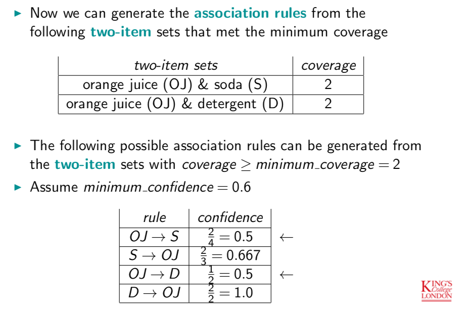
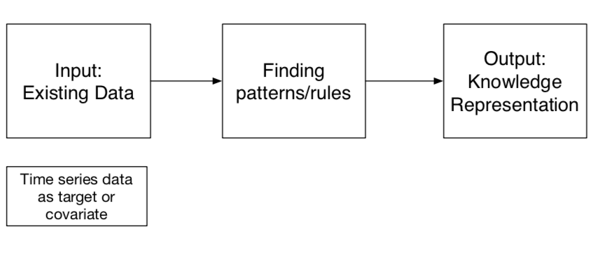
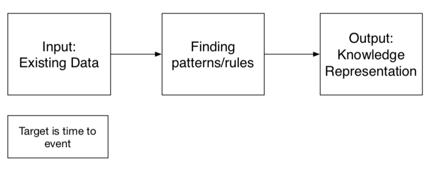

# Methods for Structured Data

## Association Rule Mining

### Defenition

#### 1. Association Rules
attribute values predict other attributes

#### 2. Association Rule Mining
learn rules that associate attributes with each other

#### 3. IF-THEN format
the **IF** part is called the **antecedent** or **pre-condition** or **Left-Hand Side (LHS)**

the **THEN** part is called the **consequent** or **conclusion** or **Right-Hand Side (RHS)**

#### 4. An antecedent may contain multiple clauses:

􏰀**conjunction**: clauses are ANDed: all clauses must be TRUE in order for the rule to fire

**disjunction**: clauses are ORed: at least one clause must be TRUE in order for the rule to fire

#### 5. item-set
An **item** is an (attribute, value) pair,
An **item-set** is a combination of (attribute, value) pairs that have a pre-specified minimum coverage.
􏰀
e.g.
**one item set**: outlook = sunny
**two item set**: outlook = sunny AND temperature = mild

**Association Rules** are derived from item sets

#### 6. Scoring Association Rules

**support** or **coverage**:
Determines how often a rule is applicable to a given data set,
Count of number of transactions containing all the items in the rule,
Divide the count by the number of transactions.

**confidence** or **accuracy**:
Determines how frequently items in the RHS appear in transactions with a specific LHS.

Score the following association rule:
$$
orange\ juice \rightarrow detergent
$$

**support count** of the rule: number of transactions where both items occur$=2$

**coverage (support)** is often represented as a fraction:
$$
\frac{support\ count}{number\ of\ transactions} = \frac{2}{5}
$$

**confidence (accuracy)**:
$$
\frac{support\ count\ rule}{support\ count\ antecedent} = \frac{2}{4}
$$

### Algorithm

1. Find all one-item sets and calculate their coverage,
2. Find all two-item sets by making pairs of the one-item sets,
3. Retain only the two-item sets that have coverage above the minimum coverage value,
4. Find all three-item sets, retaining only ones that have above minimum cover,
5. Repeat until no larger item sets are possible,
6. Each item set can now produce more than one association rule by splitting the items across the antecedent and consequent of the rule,
7. for each rule, evaluate confidence and retain if this meets the minimum requirement.

### Example

### Evaluation

#### 1. Support (Coverage)

The number or proportion of transactions that contain all the items in the set that make the rule

#### 2. Confidence (Accuracy)

Compares number of transactions containing the whole item set of the rule divided by the number of transactions containing the consequent. Measures how good the rule is at predicting the consequent

#### 3. Lift

Measures **improvement** or **utility (usefulness)** – the power of the rule, by comparing the full rule to randomly guessing the antecedent of the rule

e.g.,

- 􏰀 Rule S $\rightarrow$ OJ had a confidence of 0.667
- 4 out of 5 (0.8) transactions contain OJ
- So this rule will not improve our aim to target customers who buy orange juice

#### 4. $\chi^2$

### Computing Association Rules

1. Start by selecting all frequent item sets of size $k = 2$,
2. Grow item sets from size k =2 to size k =k+1 by pruning item sets that contain subsets where $support ≤ ps$,
3. If both (A=1,B =1) and (B =1,C =1) are frequent, we compute support for (A = 1, B = 1, C = 1) (across every instance),
4. We stop pruning when $k = a$,
5. Then we compute accuracy and evaluate $accuracy > pa$.

### Sequence Analysis

Adds an element of time to associations. Analysis considers not just associations between items, but also their order.

e.g.,

- **Customer shopping sequences**: new homeowners purchase shower curtains before purchasing furniture,
- **Customer behaviour**: when a customer asks their bank for a statement of all their accounts, this may be a sign they will move to a competitor,
- **Clickstream analysis**: websites visited.

### Link Analysis

Another technique used to analyse relationships and connections between items. Based on **graph theory**. Represents relationships between different items as edges in a graph.

e.g.,

- Social network analysis
- Crime and fraud detection
- Social marketing

## Time Series Mining

**Time Series** data refers to values over time repeatedly. It is a sequence of random variables, $x_1,x_2,…,x_t$, where $x_1$ denotes the value at time 1 or the first time point.
􏰀
Examples of time series data include:

- stock market prices,
- exchange rates
- temperature

**Time Series Mining** applications can be segmented into:

1. Representation and indexing
2. Similarity measure
3. Segmentation
4. Visualisation
5. Mining

## Survival Analysis

**Survival Analysis** is also known as **Time-to-Event Analysis**

Examples of survival analysis series data include:

- Understanding customer tenure
- Failure analysis in manufacturing
- Assessing risks across a customer’s life cycle
