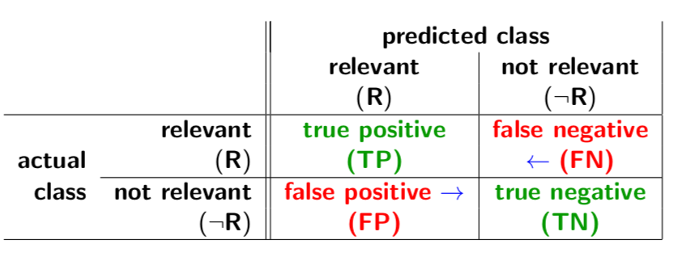

# Nature Language Processing

## Language Models

a probability distribution over all characters in the alphabet that is used in the language for a sequence of n characters

### 1. Character Models
using sequences of characters

### 2. Word Models
using sequences of words

### 3. N-gram Models

A probability distribution over all characters in the alphabet (or all words in the article) that is used in the language for a sequence of "n" characters(or words).

e.g., trigram model: a Markov chain of order 2, where the probability is derived from sequences of 3 characters (i, i −1, i −2).

- **Language Identification problem**: Identify the language in which a text (corpus) is written (search)
- Spelling correction
- Genre classification
- **Named-Entity Recognition (NER)**: identify names in a document and classify them

### Text Classification 
Decide what category a piece of text (document) belongs to

#### Two general approaches:

1. **Language Modelling (Bayesian) approach**: Uses the probability of sequences of words or characters occuring.
2. **Machine learning approach**: Derives features from the sequences of words or characters.

#### Currently Popular Tasks:

1. **Topic Analysis**: Identify topics or themes in text
2. **Sentiment Analysis**: Identify polarity or valence in text:

- Positive
- Negative
- Neutral

## Information Extraction

### Overview

Steps for information extraction:
1. Acquire specific knowledge from skimming text
2. Look for particular class of objects
3. Look for relationships between objects found

Examples:

- address consists of street, city, postcode
- weather report consists of temperature, humidity, wind speed

**Regular Expression**: A regular expression (RE) defines a set of strings L(RE)

### Deterministic Models

#### 1. Finite State Automata (FSA)
**Attribute-based extraction**: entire text refers to a single object and information extraction task is to find attributes of that object

#### 2. Relational Extraction systems
1. Tokenization,
2. Complex-word handling,
3. Basic-group handling,
4. Complex-phrase handling,
5. Structure merging.

### Probabilistic Models

#### 1. Hidden Markov Model (HMM)

#### 2. Conditional Random Fields (CRF)

### Other Approaches
1. **Ontology Extraction**: to collect a large knowledge base or an ontology of facts
2. Automated Template Construction
3. Mahine Reading

## Information Retrieval (IR)

### Representation of Text
A document can be represented as a row in a matrix of columns. Each column is a word, or term. Each row is a document. The cells in the matrix contain the number of times that a term appears in the document. Such a matrix can be very sparse.

Each document $U_j$ is represented as a term vector:

$$
U_j = (u_{(j,1)}, u_{(j,2)},...,u_{(j,N)})
$$
each u(j,i) contains information about the i-th term in the j-th document.

**Boolean representation**: $u_{j,i}$ is True if term $T_i$ is in document $U_j$

**Vector-space representation**: $u_{(j,i)}$ is the number of times that term $T_i$ appears in document $U_j$

**cosine distance**

$$
d(u, v) = \cos(\theta) = \frac{\sum_{i=1}^{N}u_iv_i}{|u||v|} = \frac{\sum_{i=1}^{N}u_iv_i}{\sqrt{\sum u_i^2}\sqrt{\sum v_i^2}}
$$

**Euclidean distance**
$$
d(u, v) = \sqrt{\sum_{i=1}^{N}(u_i - v_i)^2}
$$

The **cosine** of the angle between two term vectors provides **bigger separation** between two groups of related documents than Euclidean distance.

A **term-document matrix** (N terms ×M documents) is a representation of the documents in **term space**. Typically, this matrix is very **sparse**.

### Retrieval By Content

### Evaluation

#### 1. Confusion Matrix

**Precision**: number of documents in the result set that really are relevant
$$
precision = \frac{TP}{TP + FP}
$$

**Recall**: proportion of relevant documents that are in the result set
$$
recall = \frac{TP}{TP + FN}
$$

**TP+FP+FN+TN**: number of items in the data set ($M$)

**TP+FP**: number of items retrieved ($k_\tau$)

**TP+FN**: number of truly relevant items ($R$)

**FP+TN**: number of truly not relevant items ($\neg R$)

##### False Positive (FP) rate
fraction of truly not relevant items, FP+TN, that are incorrectly predicted to be relevant, FP:
$$
FP\ rate = \frac{FP}{FP + TN}
$$

##### False Negative (FN) rate
fraction of truly relevant items, TP+FN, that are incorrectly predicted to be not relevant, FN:
$$
FN\ rate = \frac{FN}{TP + FN}
$$

#### 2. TF-IDF

**Term Frequency (TF)**
The number of times that a term appears in a document

**Inverse Document Frequency (IDF)**
$$
IDF(T) = \log\frac{M - DF(T) + 0.5}{DF(T) + 0.5}
$$

- $M$: number of documents in the corpus,
- $DF(T)$: the number of documents that contain term$T$.

**TF-IDF**
TF-IDF $ = TF \times IDF$

