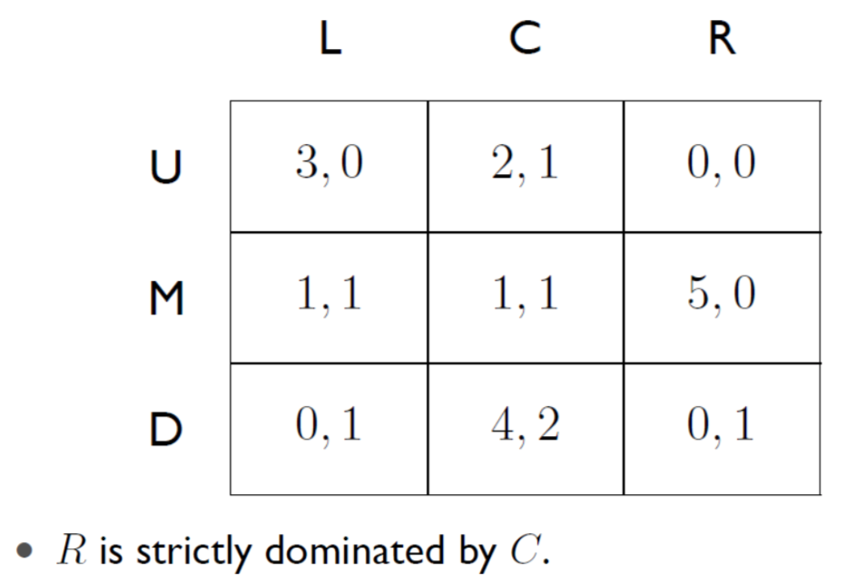

# Game Theory

## Overview

- **Actions**: What can the players do.
- **Payoff/utility**: What motivates players?
- The games will be represented in **matrix** form
- Objective: solve a game – **maximize utility**.

**Example**: Prisoner's dilemma

**Example**: More players

## Best response and Nash Equilibrium

### Best Response

The **best response** of certain player is the one that **maximize** the payoff after the other players have chosen an action.

### Nash Equilibrium

In general, we will say that two strategies s1 and s2 are in Nash equilibrium (NE) if:

1. under the assumption that agent i plays s1, agent j can do no better than play s2; and
2. under the assumption that agent j plays s2, agent i can do no better than play s1.

**Example 1**:

**Example 2**:

## Pure and mixed strategies

### Pure Strategy

**Strategies**: Actions (pure strategies) or set of actions (mixed strategies).

**Pure strategy** is when only **one** action is played.

We say **s1 dominates s2** if every outcome possible by i playing s1 is preferred over every outcome possible by i playing s2.

**Strictly dominant strategy**: Best payoff option for player i regardless other’s player action.

**Very weakly dominant strategy**: Best or equal payoff option for player i regardless other’s player action.

### Mixed Strategies

**Mixed strategies**: Player will use a mixed strategy by choosing different actions with different positive probabilities.

$$
u_i(s) = \sum_{a\in A}u_i(a)Pr(a|s) \\
Pr(a|s) = \prod_{j\in N}s_j(a_j)
$$

- If there’s no pure – strategy Nash Equilibria, there will be at least one mixed – strategy NE.
- If there’s more than one pure Nash Equilibria, there will be at least one mixed - strategy NE.
- If there’s only one pure Nash Equilibria, there’s not a mixed – strategy NE.

## Iterated Removal of Strictly Dominated Strategies

**Example 2:**

Similarly to the example, we can remove Right. There are no more pure dominated strategies. However, if we look carefully we realize that player 1 can use a mixed strategy by combining 1⁄2 of times playing U and 1⁄2 of D. With this strategy, the outcome of player 1 is 1.5 if player 2 chooses L and 2 if player 2 chooses C. We can observe that this improves action M (both outcomes are 1). Therefore we can remove M. Unfortunately, there are no more dominated strategies so the 2 x 2 action game remaining (U,D and L,C) needs to be analysed further with other techniques.

## Applications to telecommunications

1. Resource allocation
2. Combined flow and routing
3. Congestion control and data sharing
4. Pricing and revenue sharing for internet providers

