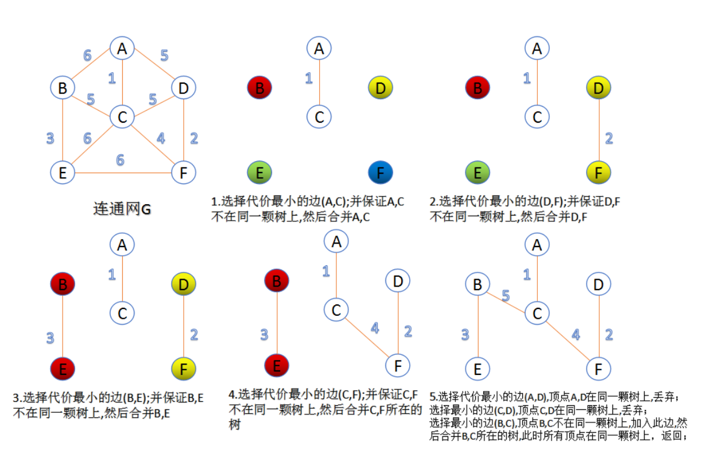

# Networks and Graphs

## Overview

### Graph Representation

1. Matrix g is referred to as an **adjacency matrix**, where gij ∈ {0, 1} represents the availability of an edge from node i to node j.

$$
\left[
  \begin{matrix}
    0 & 1 & 1\\
    1 & 0 & 1\\
    1 & 1 & 0
  \end{matrix}
\right]
$$

2. Another representation of a graph is given by (N, E ), where E is the set of edges in the network.

$$
E={(1,2),(1,3),(2,3)}
$$

### Directed Graphs

We refer to a graph as a directed graph (or digraph) if $g_{ij} \neq g_{ji}$.

$$
\left[
  \begin{matrix}
    0 & 1 & 0\\
    0 & 0 & 1\\
    1 & 0 & 0
  \end{matrix}
\right]
$$

### Neighbourhood

The **neighbourhood** of node i is the set of nodes that i is connected to.

### Degree of a Node

For undirected graphs: The **degree of node** i is the number of edges that involve i (i.e., cardinality of his neighbourhood).

For directed graphs:

- Node i's in-degree is $\sum_jg_{j,i}$
- Node i's out-degree is $\sum_jg_{i,j}$

### Connectivity of Graphs

**Connected Graph**: Any node can reach any node via a path.

**A disconnected graph** is made up by two or more connected components.

**Connected Component** of a graph is a subset of the nodes such that:

- every node in the subset has a path to every other
- the subset is not part of some larger set with the property that every node can reach every other

**Giant CC** : a connected component that contains a significant fraction of all the nodes.

### Connectivity of Directed Graphs

**Strongly connected**: Any node can reach any node via a directed path.

**Directed Acyclic Graph (DAG)**: Has no cycles: e.g if E can reach D, then D can not reach E.

**Strongly Connected Components (SCCs)** is a set of nodes S so that:

- Every pair of nodes in S can reach each other.
- There is no larger set containing S with this property.

SCCs are {A, B, C, G}, {D}, {E}, {F}

### Weighted Graphs

The edge weight $g_{ij} > 0$ can also take on non-binary values, representing the intensity of the interaction, in which case we refer to (N, g ) as a **weighted graph**.

### Complete Graphs

- Graph with the maximum number of edges ($E = E_{max}$)
- For a graph with n node, that is $\frac{n(n-1)}{2}$ edges.

### Bipartite Graphs

- graph whose nodes can be divided into two disjoint sets U and V.
- every link connects a node in U to one node in V (U and V are independent sets).

### Trees

A **tree** is a connected (undirected) graph with no cycles.

- A connected graph is a tree if and only if it has n-1 edges.
- In a tree, there is a unique path between any two nodes.

### Walks, Paths, and Cycles in a Graph

For an undirected graph (N, g ):

- A **walk** is a sequence of edges $\{i_1,i_2\}, \{i_3,i_4\}, ..., \{i_{k-1},i_k\}$.
- A **path** between nodes i and j is a sequence of edges $\{i_1,i_2\}, \{i_3,i_4\}, ..., \{i_{k-1},i_k\}$ such that $i_1 = i$ and $i_k = j$, and each node in the sequence $i_1, ..., i_k$ is distinct.
- A **cycle** is a path with a final edge to the initial node, $i_1 = i_k$

A path is a walk where there are no repeated nodes. 

## Eulerian Path

An **Eulerian path** in a graph 𝐺 is a path that passes through **every edge** of 𝐺 exactly **once**.

An **undirected graph** has an Eulerian tour if and only if all its vertices have **even degree**.

A **directed graph** has an Eulerian cycle if and only if every vertex has **equal in degree** and **out degree**.

## Network Properties

### Degree distributions, P(k)

- Probability that a randomly chosen node has degree k
- $N(k)$ = number of nodes with degree k
- $P(k) = \frac{N(k)}{n}$

### Distance

**Distance** between a pair of nodes is defined as the number of edges along the shortest path connecting those nodes.

### Diameter and average path length

Let **h(i, j)** denote the length of the **shortest path** between node i and j (or the **distance** between i and j). The **diameter of a network** is the **largest** distance between any two nodes in the network:

$$
diameter = max\ h(i, j)
$$

The average path length is the average distance between any two nodes in the network.

$$
average\ path\ length = \frac{\sum_{i\leq j}h(i,j)}{0.5n(n-1)}
$$

Average path length is bounded from above by the diameter; in some cases, it can be much shorter than the diameter.

### Clustering Coefficient

What portion of i's neighbors are connected

Node i with degree $k_i$

$$
C_i = \frac{2e_i}{k_i(k_i - 1)}
$$

where $e_i$ is the number of edges between the neighbors of node i

**Average clustering**

$$
C = \frac{1}{N}\sum_i^NC_i
$$

## Sub-graphs and network algorithms

### Sub-graphs

G' = (N',A') is a sub-graph of G = (N,A) if

- G' is a graph
- N' is a subset of N
- A' is a subset of A

### Spanning Tree

For any connected graph there is a spanning tree that maintains connectivity but contains no cycle (close loop).

T (N', E') is a spanning tree of G(N, E) if

- T is a sub-graph of G with N' = N and T is a tree

[最小生成树算法](https://blog.csdn.net/luoshixian099/article/details/51908175)

#### Kruskal's algorithm

#### Prim's algorithm

## 图遍历算法

### BFS

### DFS

## Shortest Path Algorithm

### Dijkstra

## Random Graphs & Erdos-Renyi model of random graph

### Random Graphs

We use the notation $G_{np}$ to denote the undirected Erdös- Renyi graph - a Simple Random Graph Model.

- Undirected graph with n nodes
- Each edge (u, v) is formed with probability $p \in (0, 1)$ independently of every other edge

#### Edges Distribution of a Random Graph

The probability that a given $G_{np}$, produces a graph of exactly E edges, P(E).

$$
P(E) = \left(\begin{matrix}E^{max}\\E\end{matrix}\right) p^E (1-p)^{E_{max} - E}
$$

P(E) is the Binomial distribution.

#### Degree Distribution of a Random Graph

A graph in G(n, p) has on average $\left(\begin{matrix}n\\2\end{matrix}\right)p$ edges (degrees).

$$
\left(
  \begin{matrix}
    n\\2
  \end{matrix}
\right) = \frac{n!}{k!(n-k)!}
$$

- P(k) denotes the fraction of nodes with degree k.
- P(k) has the Binomial distribution.

$$
P(k) = \left(\begin{matrix}n-1\\k\end{matrix}\right) p^k (1-p)^{n-1-k}
$$

Mean and variance of a Binomial distribution

$$
\bar k = p(n-1)
$$

$$
\sigma^2 = p(1-p)(n-1)
$$

### Clustering Coefficient in random graphs

The clustering coefficient were represented as:

$$
C_i = \frac{2e_i}{k_i(k_i - 1)}
$$

Edges in $G_{np}$ appear i.i.d with probability p.

$$
e_i = p \frac{k_i(k_i - 1)}{2}
$$

The clustering coefficient can be re-written as:

$$
C = \frac{p*k_i(k_i-1)}{k_i(k_i-1)} = p = \frac{\bar{k}}{N}
$$

For a fixed average degree, C decreases with the network size N

### Extract

[sequence degree画graph](http://szhorvat.net/pelican/hh-connected-graphs.html)

