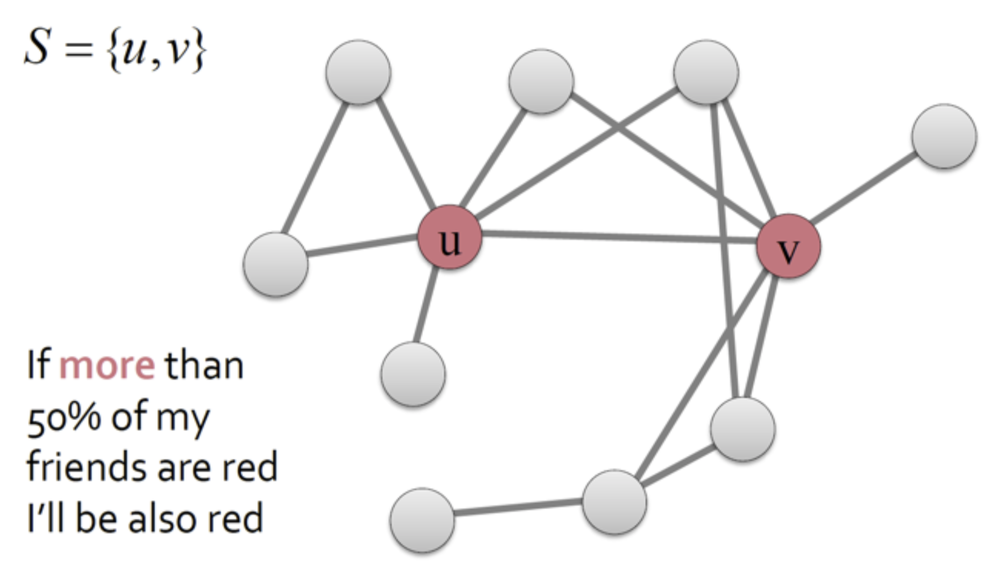
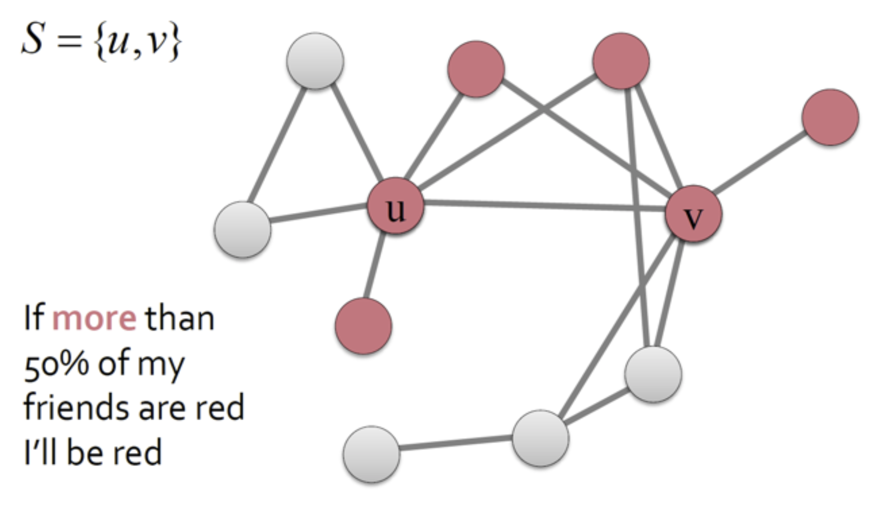
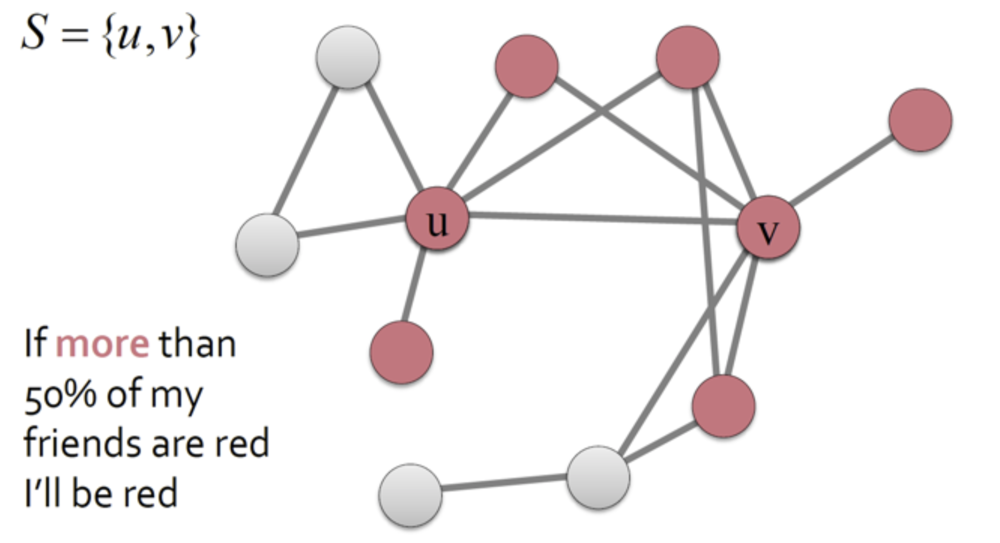
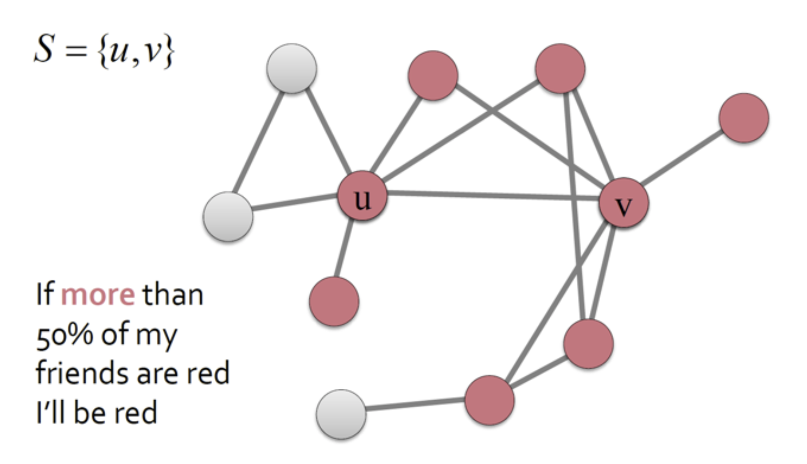
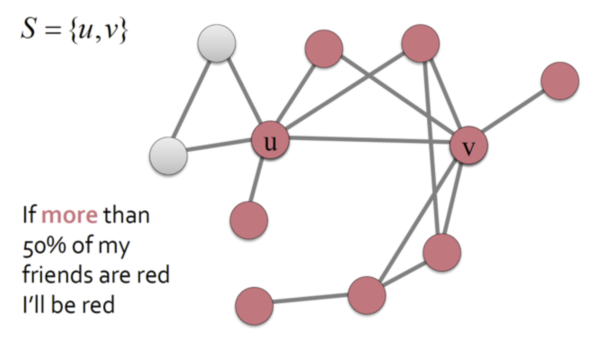
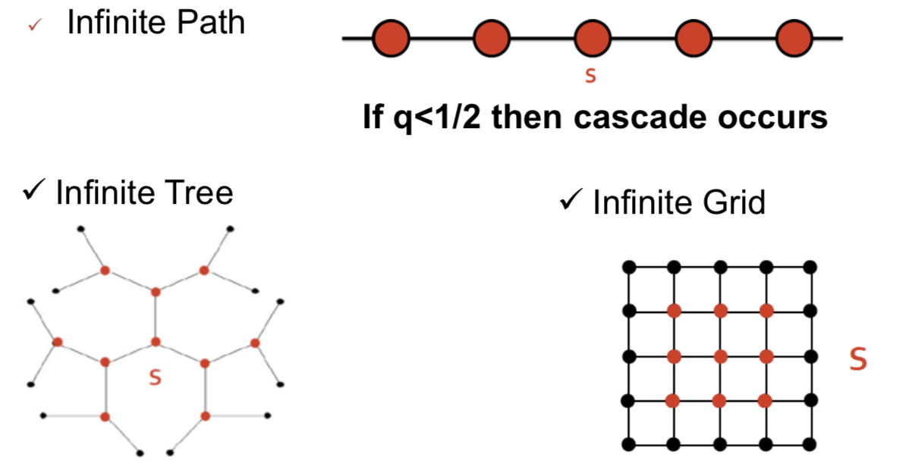

# Probabilistic models of Information flow

## Information Cascade

When information nodes are connected by a network, it becomes possible to influence each other’s truth. Behaviors that cascade from node to node like an epidemic.

## Diffusion Model

- Models of product adoption, decision making
- A node observes decisions of its neighbours and makes its own decision
- **Example**: You watch a movie if k of your friends told you about it.

### Coordination Game

Let’s assume we have a situation in which each node has a choice between two possible behaviours, labelled A and B.

*If nodes **v** and **w** are linked by an edge, then there is an incentive for them to have their behaviours match.*

|a, a|0, 0|
|---|---|
|0, 0|b, b|

The payoffs are defined as follows:

- if v and w both adopt behaviour A, they each get a payoff of a > 0;
- if they both adopt B, they each get a payoff of b > 0;
- if they adopt opposite behaviours, they each get a payoff of 0.

Suppose that **p fraction of v’s neighbours** have behaviour A, and a (1 − p) fraction have behaviour B.

- if v has **d neighbours**, then **pd** adopt A and **(1 − p)d** adopt B.
- If v chooses A, it gets a payoff of **pda**,
- If v chooses B, it gets a payoff of **(1 − p)db**.

A is the better choice if

$$
pda \geq (1-p)db \\
p \geq \frac{b}{a + b}
$$

**Threshold rule**: if at least $q = \frac{b}{a+b}$ (q is the threshold) fraction of your neighbours follow behaviour **A**, then you should too.

## Decision Based Models

- Models of product adoption, decision making
- A node observes decisions of its neighbours and makes its own decision
- **Example**: You watch a movie if **k** of your friends told you about it.

### Cascade Behaviour

Suppose that everyone in the network is initially using B as a default behaviour.

Then, a small set of “initial adopters”, S, all decide to use A.

Depend on the network structure, the choice of initial adopters, and the value of the threshold q.

**Example:**

### Cascade Capacity

Consider infinite graph **G**, each node has finite number of neighbours.

We say that the **cascade capacity** of the network is the **largest value** of the **threshold q** for which **some finite set S** of early adopters can cause a **complete cascade**. 

There is **no network** in which the cascade capacity **exceeds 1/2** .

**Examples**:

## Probabilistic Models

- Models of influence or disease spreading
- **Example**: You “catch” a disease with some probability from each active neighbour in the network

### Epidemic

- A patient meets **d** other people in the hospital
- With probability **q > 0** infects each of the d others

Let $p_h = probability$ that there is an infected node in depth **h** of the tree.

$$
p_h = 1 - (1 - q * p_{h-1})^d
$$

Expected number of people that infects: $q*d$

### SIR Model

### SIS Model

