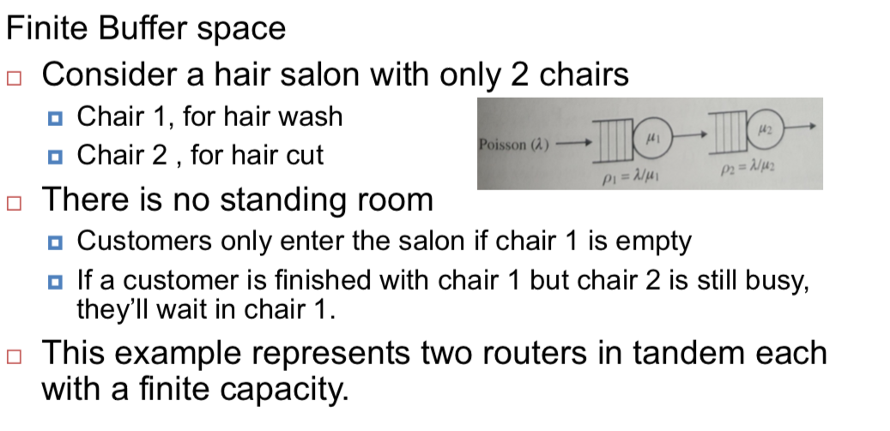
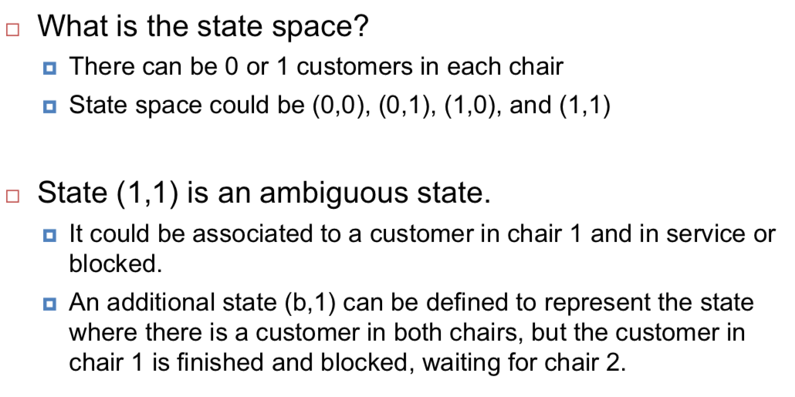
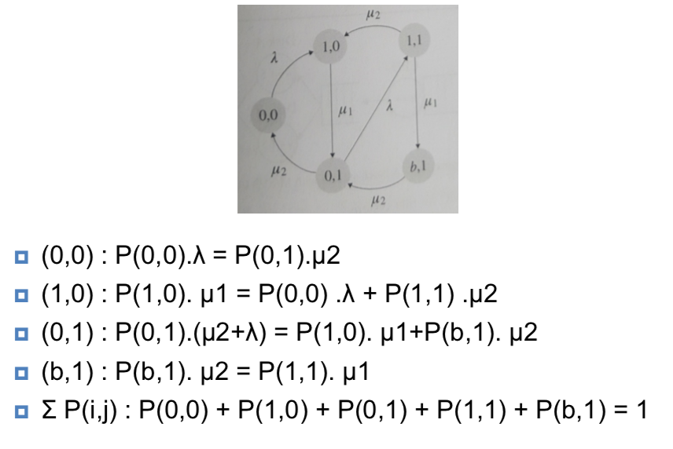
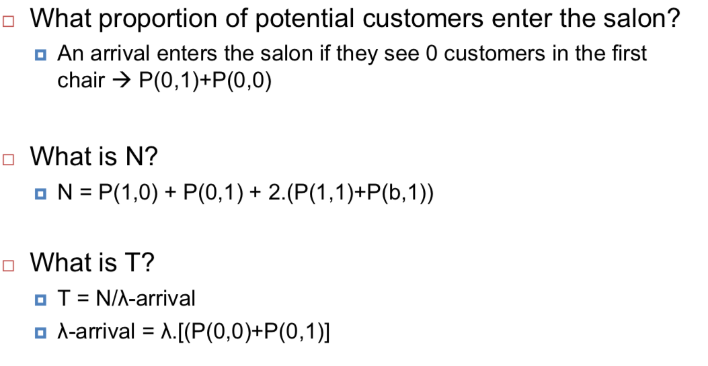
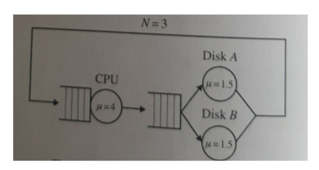
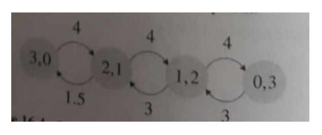
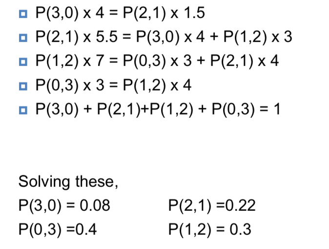

# Networks of Queues

## Kleinrock’s Independence Approximation

## Bruke’s Theorem

## Jackson’s Theorem

Consider a network of **K** single-server queues in which

- customers arrive from outside the network at each queue i in accordance with independent Poisson processes at rate $r_i$.
- We allow the possibility that $r_i = 0$, in which case there are no external arrivals at queue i.
- but we require that $r_i > 0$ for at least one i.

We now view the system as,

- a continuous-time Markov chain
- with states $n_1, n_2, , ..., n_K$
- Where $n_i$ denotes the number of customers at queue i.
- State vector is denoted by $n = (n_1, n_2, , ..., n_K)$.

$P(n_1, n_2, , ..., n_K)$ is defined as the stationary distribution of the chain.

**Jackson's theorem**:
$$
P(n) = P(n_1, n_2, ..., n_k) =\prod_{i=1}^{K}P_i(n_i) = \prod_{i=1}^{K}\rho_i^{n_i}(1-\rho_i)
$$

## Examples

### Example 1: Network of transmission lines

### Example 2: Network of Queues and the markov chain

### Example 3: Closed Network of Queues

Consider a system consisting of one CPU queue and one IO queue, where the IO queue is served by two disks, operating as an M/M/2 systems.

State space is (3,0), (2,1), (1,2), (0,3)

- State (i,j) represents the fact that there are i jobs in CPU queue and j jobs in the disk subsystem.

