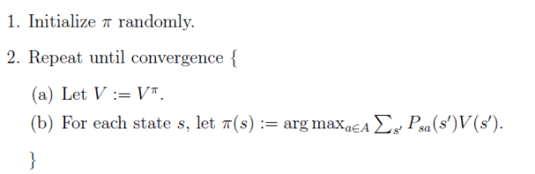
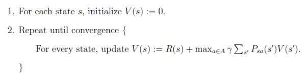

# Markov Decision Processes

## Introducing decision on Markov processes

A typical Markov process consists of a set of states of transitions. The system is completely defined with these parameters. Goal: select actions to **maximise total future reward**.

## Rewards and actions

## Agents and environments

Policy based agent

- Policy
- No value function

Value based agent

- No policy (implicit)
- Value function

A MDP is defined as a tuple <S,A,T,R,Υ>

- A finite set of **s**tates
- A finite set of **a**ctions
- A transition probability matrix **T**.
- **R** is the reward function
- **Υ** is a discount factor: Υ is (0,1)

## Planning and learning

## Solving model-free and model-based scenarios

Bellman expectation equation

$$
v_{\pi}(s)\mathbb{E}_{\pi}[R_{t+1} + \gamma v_{\pi}(S_{t+1})|S_t = s]
$$

Also as a q-ation function as:

$$
q_{\pi}(s, a) = \mathbb{E}_{\pi}[R_{t+1} + \gamma q_{\pi}(S_{t+1}, A_{t+1})|S_t = s, A_t = a]
$$

policy iteration

value iteration

[策略迭代和值迭代（知乎）](https://www.zhihu.com/question/41477987)

