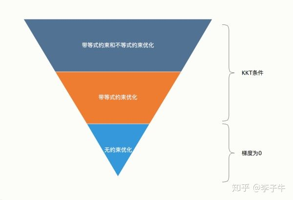
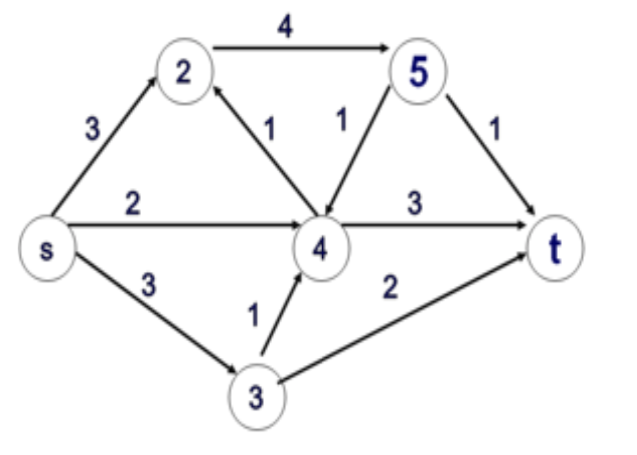
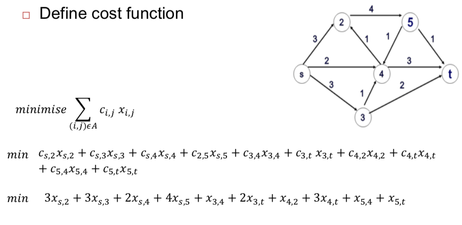

# Examples of Network Opimisation

Lecture 11, 12

## Classification of optimisation problems

## Solving Optimisation Problems

## Conditions for local optimality

## Karush-Kuhn-Tucker Necessary Conditions

[Karush-Kuhn-Tucker (KKT)条件](https://zhuanlan.zhihu.com/p/38163970)

### Example

$$
min\ \ 6(x_1 - 10)^2 + 4(x_2 - 12.5)^2 \\
s.t.\ x_1^2+(x_2 - 5)^2 \leq 50 \\
x_1^2 + 3x_2^2 \leq 200 \\
(x_1-6)^2 + x_2^2 \leq 37
$$

Determine whether or not the point $\bar x = (7, 6)$ is a condidate to be an optimal solution.

## Minimum Cost Problem

The minimum-cost flow problem is finding the cheapest possible way of sending a certain amount of flow through a network.

### Example

- Consider the graph as a representation of a network
-  Links’ weights c_{i,j} represent the cost of transmitting one unit of flow over the link from node i to node j
-  Node s has 10 units of flows to transmit to node t
-  Formulate the problem that minimises the transmission cost from s to t in this network.

#### 1. Define Model

1. Define decision variables

2. Represent cost of transmitting

#### 2. Define cost function

#### 3. Define constraints

## Maximum Flow Problem

### Ford–Fulkerson algorithm

[最大流算法](https://zhangxiaoyang.me/categories/intro-to-algorithms-tutorial/intro-to-algorithms-tutorial-7.html)

