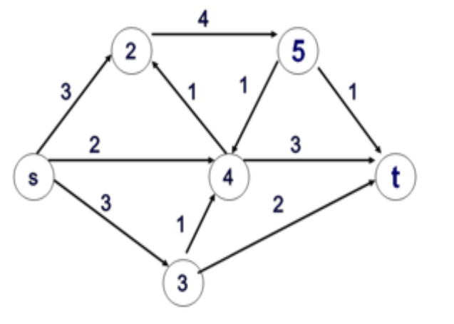
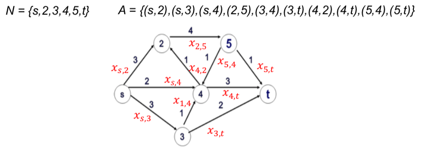
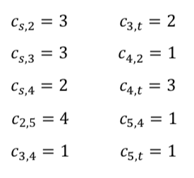
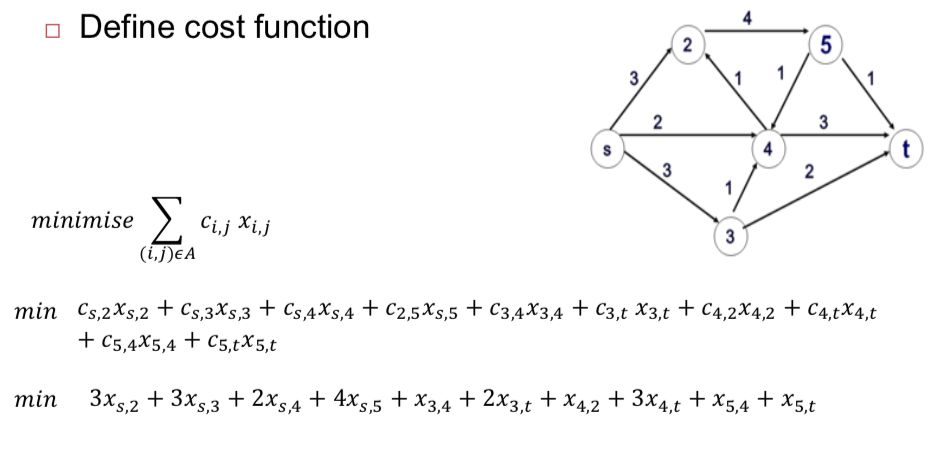
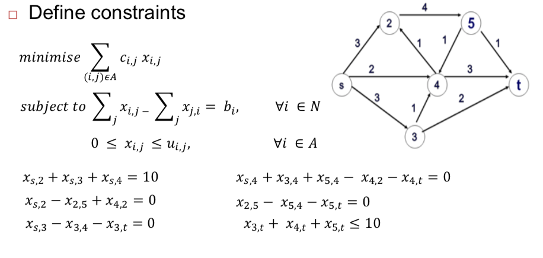

# Network Flow Optimisation

## Steps of network optimisation

## How to build a Mathematical Model

## Minimum Cost Problem

The minimum-cost flow problem is finding the cheapest possible way of sending a certain amount of flow through a network.

### Example

- Consider the graph as a representation of a network
-  Links’ weights c_{i,j} represent the cost of transmitting one unit of flow over the link from node i to node j
-  Node s has 10 units of flows to transmit to node t
-  Formulate the problem that minimises the transmission cost from s to t in this network.

#### 1. Define Model

1. Define decision variables

2. Represent cost of transmitting

#### 2. Define cost function

#### 3. Define constraints

## Maximum Flow Problem

### Ford–Fulkerson algorithm

[最大流算法](https://zhangxiaoyang.me/categories/intro-to-algorithms-tutorial/intro-to-algorithms-tutorial-7.html)