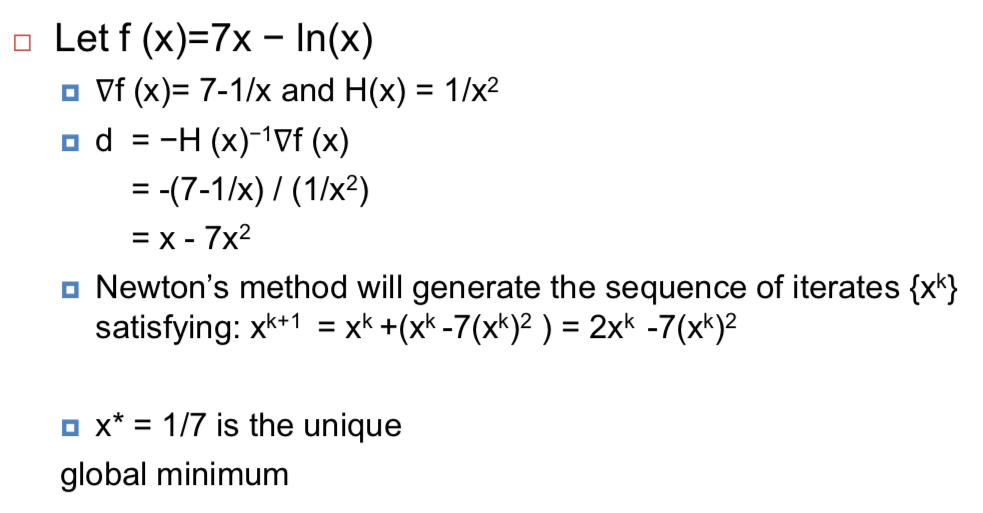
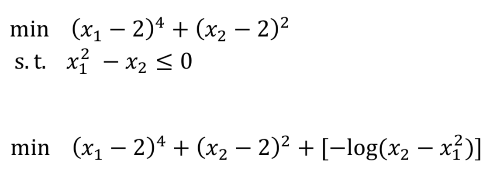
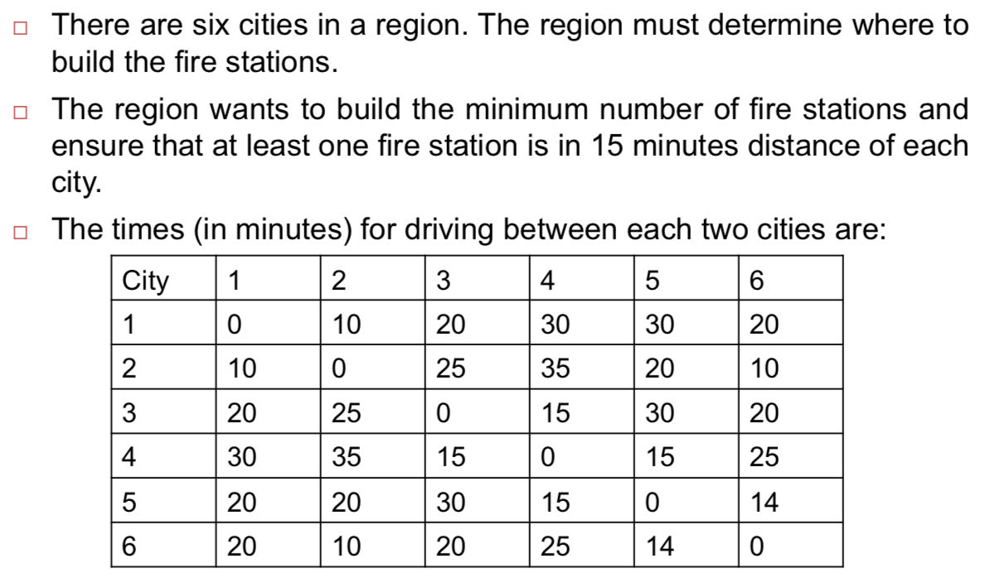
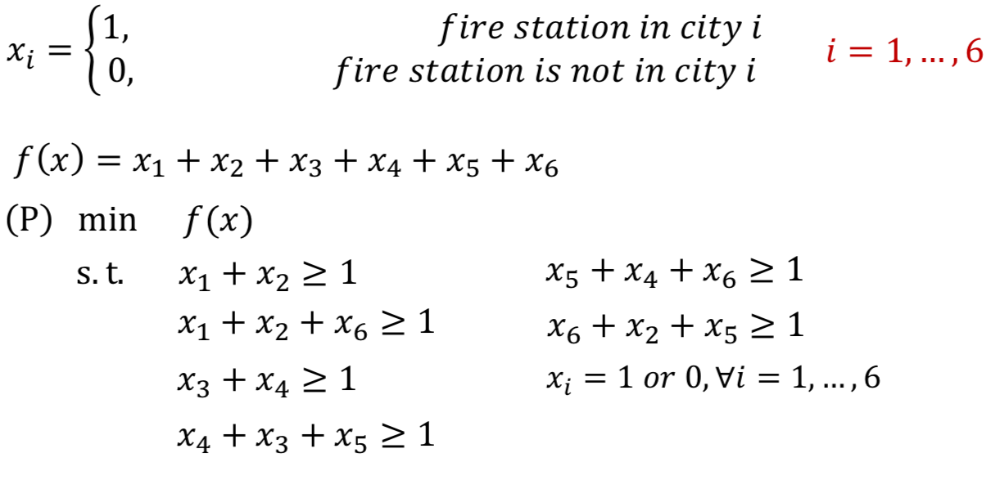
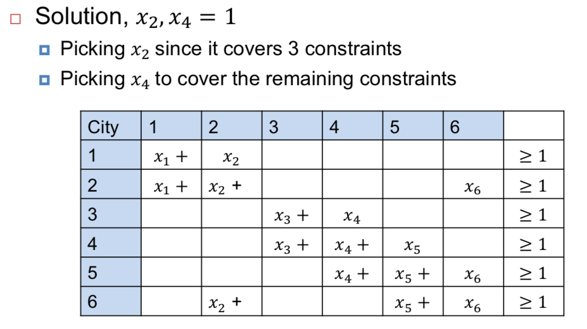

# Solving Optimisation Problems

Lecture 13, 14, 15

## Convex problems

### Unconstrained Problems: Newton's algorithm

In numerical analysis, **Newton's method** is a method for finding successively better approximations to the **roots (or zeroes)** of a real-valued function.

We want to find $x$: $f(x) = 0$

1. Choose a starting point $x_0$
2. Obtain a better approximation $x_1 = x_0 - \frac{f(x_0)}{f'(x_0)}$
  - Geometrically, $(x_1, 0)$ is the intersection of the x-axis and the tangent of function $f$ at $(x_0, f(x_0))$, where the tangent is $y = f'(x_n)(x - x_n) + f(x_n)$
3. The process is repeated until a more accurate approximation is found $x_n = x_{n-1} -\frac{f(x_{n-1})}{f'(x_{n-1})}$

**Example**

### Constrained Problems

#### Lagrangian Dual Problem

[简易解说拉格朗日对偶（Lagrange duality）](https://www.cnblogs.com/90zeng/p/Lagrange_duality.html)

[Lagrange Duality（知乎）](https://zhuanlan.zhihu.com/p/32501517)
$$
\begin{align*}
Min\ & f(x) \\
Subject\ to\ & g_i(x) \leq 0 \\
& h_i(x) = 0
\end{align*}
$$

$$
\begin{align*}
L(x, u, v) &= f(x) + \sum_{i=1}^mu_ig_i(x) + \sum_{i=1}^lv_ih_i(x) \\
&= f(x) + u^tg(x) + v^th(x)
\end{align*}
$$

#### Penalty method

##### 1. Barrier method

A **barrier function** for P is any function $b(x)$: that satisfies

- $b(x)\geq 0$ for all $x$ that statisfy $g(x) < 0$, and
- $b(x) \rightarrow \infty$ as $\lim_x \max_i \{g_i(x)\} \rightarrow 0$.

##### 2. Lograithmic Barrier

Our goal is to approximately formulate the constrained problem (P) as an unconstrained problem to which e.g. Newton’s method can be applied.

$$
min\ f(x) + \sum_iI\_(g_i(x)) \\
where\ I\_(u) = 
\left\{
  \begin{array}{**lr**}
    0\ & u\leq 0 \\  
    \infty & u > 0
  \end{array}
\right.
$$

## Integer Programming

### Integer programming

#### Pure 0-1 programming (binary)

Generic formulation

$$
(P)\ \min_xc^Tx \\
s.t. Ax \leq b\ (x_i = 0\ or\ 1, \forall i = 1,...,n)
$$

**Example**

#### Scheduling problem

In wireless communications, one of most challenging problem is assignment of radio resources to users connected to a cell.

**Objective**: maxmise the overall data rate of the cell.

## Knapsack Problem

$$
\begin{align*}
Maxmise\ & \sum_{i=1}^pu_ix_i \\
Subject\ to\ & \sum_{i=1}^pw_ix_i \leq W \\
& x_i = \{0, 1\}\ for\ all\ i
\end{align*}
$$

### Greedy Algorithms

### Heuristic Algorithms

### Genetic Algorithms

1. **[Start]** Generate random population of n chromosomes (feasible solutions for the problem)
2. **[Fitness]** Evaluate the fitness f(x) of each chromosome x in the population
3. **[New population]** Create a new population by repeating following steps until the new population is complete
  1. **[Selection]** Select two parent chromosomes from a population according to their fitness (the better fitness, the bigger chance to be selected)
  2. **[Crossover]** With a crossover probability cross over the parents to form a new offspring (children). If no crossover was performed, offspring is an exact copy of parents.
  3. **[Mutation]** With a mutation probability mutate new offspring at each locus (position in chromosome).
  4. **[Accepting]** Place new offspring in a new population
4. **[Replace]** Use new generated population for a further run of algorithm
5. **[Test]** If the end condition is satisfied, stop, and return the best solution in current population
6. **[Loop]** Go to step 2

[遗传算法求解背包问题](https://blog.csdn.net/lilong117194/article/details/78906488)

[遗传算法求解0/1背包问题](https://blog.csdn.net/juxie_XP/article/details/70801247)
