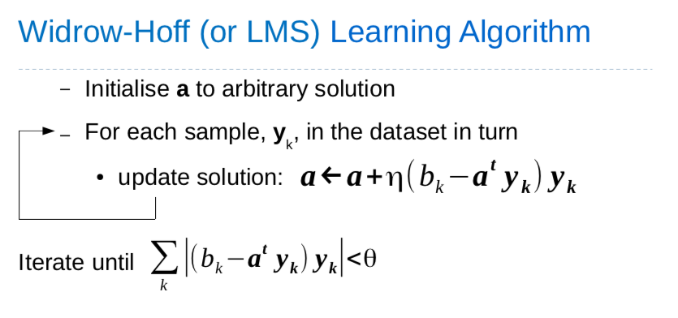

# Discriminant Function

Supervised Learning

Generalisation

## Overview

## Sample Normalisation

If we replace all samples from class ω2 by their negatives (called sample normalisation):
$$
y \leftarrow -y\ \forall y \in \omega_2
$$

Then, a sample $y_k$ is correctly classified if: $a^ty_k > 0$ and $y_k$ is labelled $ω_1$ and $a^ty_k > 0$ and $y_k$ is labelled $ω_2$

This allows us to ignore class labels and look for a vector a such that $a^ty_k > 0\ \forall k$

so that we can define $b$:
$$
a^ty_k > b\ \forall k
$$

where b is a positive number, called the **margin**

## Gradient Descent Procedures

## Perceptron Learning

### Overview
- Uses gradient descent procedures to calculate suitable linear discriminant functions
- Learning driven by misclassified exemplars
- Converges only if data is linearly separable
- Solves linear inequalities $a^ty_k > 0\ \forall k$

### Batch Perceptron Learning Algorithm

1. initialise $a$ to arbitrary solution
2. compute gradient vector at $a$: $ \nabla J_p(a) = \sum_{y \in \chi}(-y)$
3. move solution in direction of steepest descent: $a \leftarrow a + \eta\sum_{y \in \chi}y$
4. repeat from step 2

### Sequential Perceptron Learning Algorithm

1. initialise $a$ to arbitrary solution
2. for each sample, $y_k$, in the dataset in turn
  if $y_k$ is misclassified
    - move solution towards $y_k$: $a \leftarrow a + \eta y_k$
    - repeat from step 2

### Multiclass Perceptron Learning Algorithm

1. for each possible class, $c$, initialise $a_c$ to arbitrary solution
2. for each sample, $y_k, \omega_k$ in the dataset in turn
  - classify: c' = argmax $g_c(x_k)$
  - if $y_k$ is misclassified (i.e. $c' \omega_k$)
    - move $a_{\omega_k}$ towards $y_k$: $a_{\omega_k} \leftarrow a_{\omega_k} + \eta y_k$
    - move $a_{c'}$ away from $y_k$: $a_{c'} \leftarrow a_{c'} - \eta y_k$
    - repeat from step 2

## Minimum Squared Error (MSE) Procedures

### Overview
- Solves linear equations $a^ty_k = b_k\ \forall k$
- Give result even if data is not linearly separable
- Learning depends on all exemplars
- Uses matrix inversion to calculate suitable linear discriminant functions

### MSE via Pseudoinverse

### MSE via Gradient Descent

### Widrow-Hoff (or LMS) Learning Algorithm

