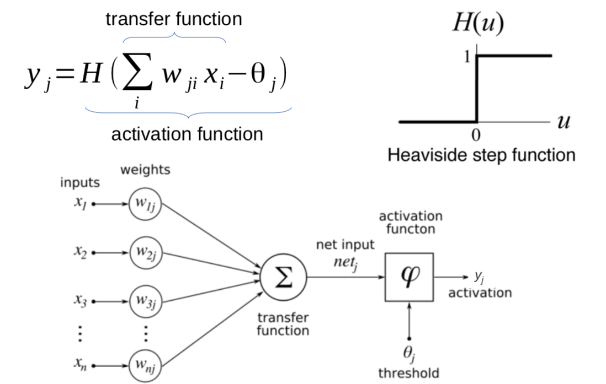
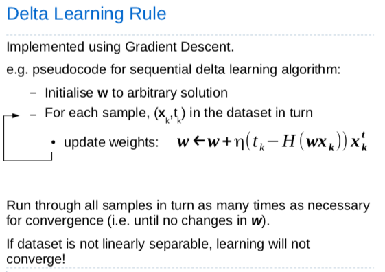
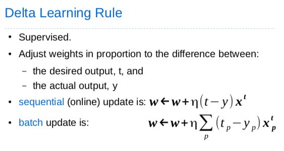
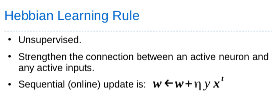
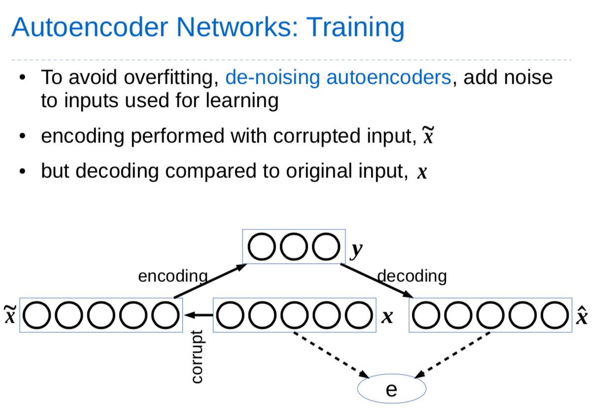

# Neural Networks

## Overview

What is an artificical Neural Network?

An ANN is a **parallel computational** system consisting of many simple processing elements **connected** together in a specific way in order to perform a particular task.

## Linear Threshold Units (Perceptrons)

A **linear discriminant function** is a linear combination of feature values:
$$
g(x) = w^tx + w_0
$$

A **single linear threshold unit** is **equivalent** to a single linear discriminant function.

### Learning

#### 1. Delta Learning Rule

#### 2. Hebbian Learning Rule

## Competitive Learning Networks

## Negative Feedback Networks

- Activation
  - Initialise $y$ to zero
  - perform serveral iterations of:
    - Update input units: $e = x - W^Ty$
    - Update output units: $y \leftarrow y + \alpha We$
- Learning $W \leftarrow W + \beta ye^T$ (Where $\alpha$ and $\beta$ are non-negative parameters)

## Autoencoder Networks

