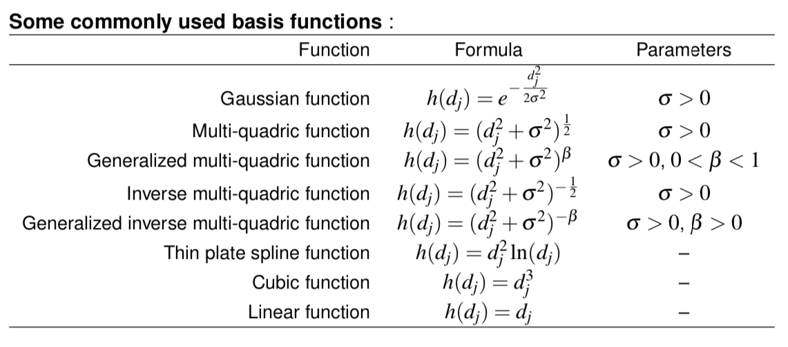

# Multilayer Neural Networks

## Introduction

### Activation Functions

The activation function **can't be** a **signum** function, it is often required to be **continuous** and **differentiable**.

## Feedforward Neural Networks

## Backpropagation Algorithm

## Radial Basis Function Neural Networks

An RBF network network is a three-layer network: input, hidden and output layers.

- Input unit: Linear transfer function,
- Hidden unit: Radial basis function, $h(*)$,
- Output unit: Any activation function, $f(*)$.

### Two phases of trainin

#### 1. (Unsupervised learning) Determine the centres $c_j$

1. Choose number of hidden units, $n_H$
2. Pick randomly $n_H$ input pattern from the data set (with n input patterns) as the centres $c_j, j=1,...,n_H$.
3. When Gausian function is employed, define $\sigma_j = \frac{\rho_{max}}{\sqrt{2n_H}}$ or $\sigma_j=2\rho_{avg}$ for all $j$ where $\rho_{max}$ is the maximum distance between the chosen centres and $\rho_{avg}$ is the average distance between the chosen centres.
4. Other parameters are chosen randomly

#### 2. (Supervised learning) Determine the output weights $w_{kj}$

