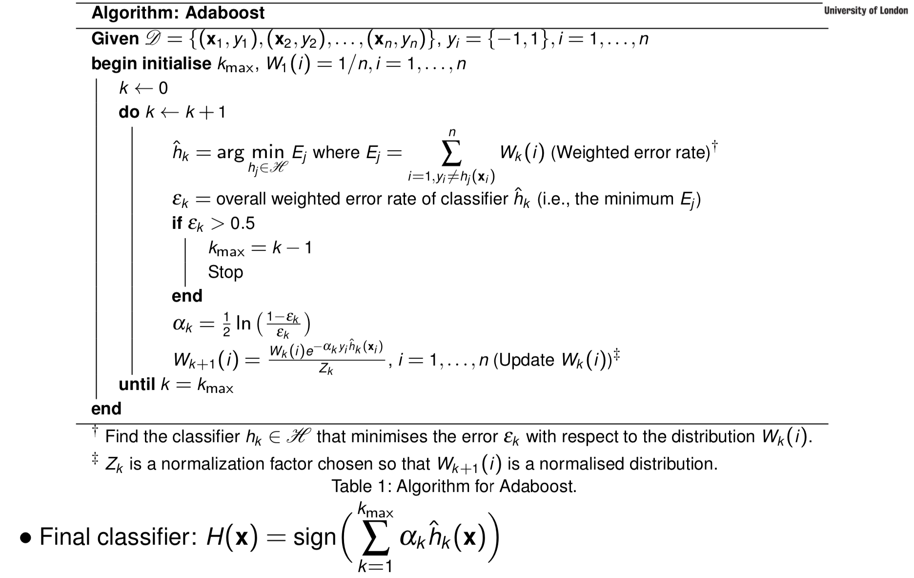
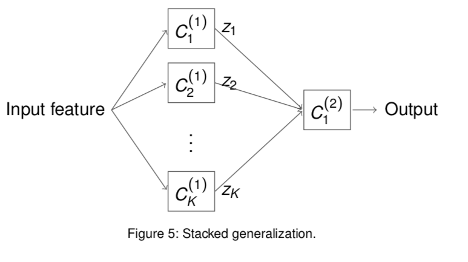
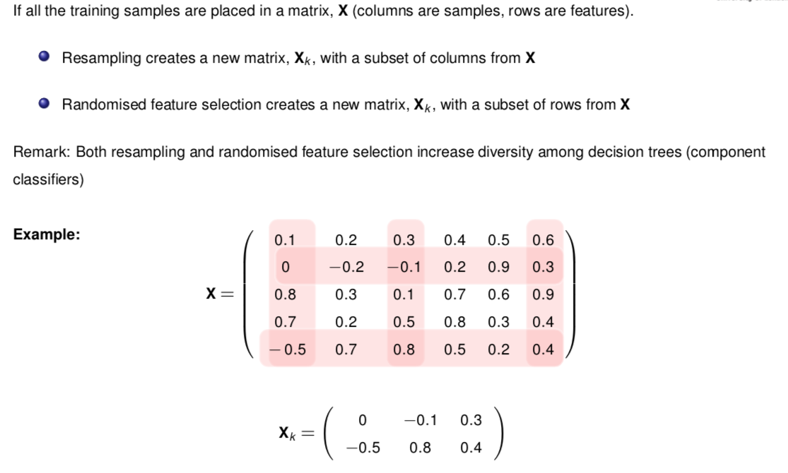

# Ensemble Method

## Introduction

Each **weak classifier** is a simple classifier, (e.g., a half-space classifier, can be slightly better choosing randomly/blindly), given by a different dataset (generated by resampling). Combine classifiers to be a final one.

1. Reduces variance
2. Reduces bias
3. Improves the estimate if the learning algorithm is unstable

## Bagging

- Uses multiple versions of a training set.
- Each created by drawing n′ < n samples from D with replacement.
- Each bootstrap data set is used to train a different weak classifier.
- Final classification decision is based on the vote of each weak classifier.

## Boosting

- First create a classifier with accuracy on the training set greater than average.
- Then add new component classifiers to form an ensemble whose joint decision rule has arbitrarily high accuracy on the training set.

###  Adaptive Boost (AdaBoost)

## Stacked generalization

In **stacked generalisation**, the overall classification is done in **two levels**. The input will be processed by a group of classifiers in the first level. The output from the first layer will go though the classifier in the second level to make the final decision.

1. Prepare $K$ sub-training dataset: $D_1$, $D_2$, ···, $D_K$ of different size and samples.
2. Train the $k^{th}$ classifier using training dataset $D_k$, $k = 1, 2, ..., K$.
3. Createanewtrainingdatasetforthesecond-levelclassifier.Theoutputsof the first-level classifiers ($z_1, z_2, ···, z_K$) and the target output ($y$) of the classification problem (supervised) are taken to form the new dataset $D_{new}$.
4. Train the second-level classifier using the dataset $D_{new}$.

## Structure of ensemble classifiers

### Parallel Structure

All classifiers will make decision **independently**. The result will be combined by the combiner (e.g., averaging, voting, weighted voting, adaptive weights, etc.).

The introduced ensemble approaches such as **bagging**, **boosting** and **AdaBoost** approaches use this structure.

### Serial Structure

A particular structure of hierarchical (tree) structure. Information and decision result are propagated to the later level for making decision.

### Hierarchical

A general structure of parallel/serial structure. Combination of methods of parallel and serial structure can be used.

## Random Forests and Decision Trees

### Decision Tree

### Random Forests

A **random forest** is an ensemble of **bagged decision trees** with **randomised feature selection**. The final decision is made by combining the decisions from all decision trees.

- **Bagging**: randomly drawn subset of the training data,
- **Randomised feature selection**: randomly drawn subset of features.

