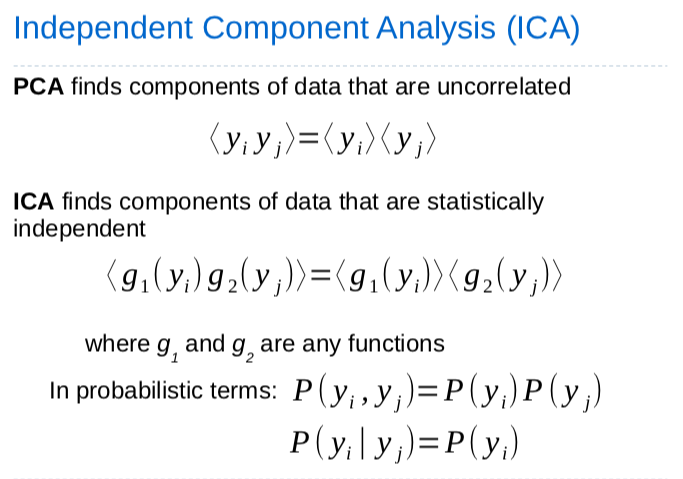

# Feature Extraction

## Overview

### Feature Selection

**Feature selection** is the process of choosing the most **discriminative subset** of data on which to perform the classification process.

### Feature Extraction

**Feature extraction** is the process of **finding features** that are **functions** of the raw data, or **projecting** original data points into **new feature space**.

## Principal Component Analysis (PCA)

### Karhunen-Loeve Transform (KLT)

1. Calculate mean of all data vectors, $\mu = \frac{1}{N}\sum_{i=1}^{N}x_i$
2. Calculate coveriance matrix of zero-mean data, $C = \frac{1}{N}\sum_{i=1}^{N}(x_i - \mu)(x_i - \mu)^T$
3. Find eigenvalues ($E$) and eigenvectors ($V$) of C, $C = VEV^T$
4. Order eigenvalues from large to small, and discard small eigenvalues and their respective vectors
5. Form matrix($\hat{V}$) of remaining eigenvectors and apply to data (with mean subtracted), $y_i=\hat{V}^T(x_i - \mu)$

### Neural Networks for PCA

#### Oja's Rule

For one neuron: $w$ is aligned with $1^{st}$ principal component weight decay term causes $w$ to approach unit length.

$$
\Delta w = \eta y (x^t - yw)
$$

#### Sanger's Rule

For each neuron: subtract from $x$ the contribution of the neurons representing the $1^{st}$ j-1 principal components, then apply oja’s rule

$$
\Delta w_{ji} = \eta y_j(x_i-\sum_{k=1}^{j}y_kw_{ki})
$$

## Whitening

**Whitening** makes the covariance matrix in the new space equal to the identify matrix: each dimension then has the same variance.

## Linear Discriminant Analysis (LDA)

**Linear Discriminant Analysis** seeks a projection that is **maximally discriminative**.

### Fisher's Method

Fisher’s method for defining a decision boundary finds a weight vector that **maximises the between class scatter**, while **minimising the within class scatter**.  This is given by the objective function $J(w) = \frac{sb}{sw}$, where $sb$ is the between class scatter, and $sw$ is the within class scatter.

## Independent Component Analysis (ICA)

## Random Projections

## Sparse Coding

Like random projections:

- data is projected into a high-dimensional space in the hope that this will make classes more separable.

Unlike random projections:

- only a few of the dimensions are used to represent any one exemplar.
  -  exemplars are projected onto a subspace (technically a manifold as mapping is nonlinear) of a high-dimensional space.
- projection is not random

## Deep Learning.  