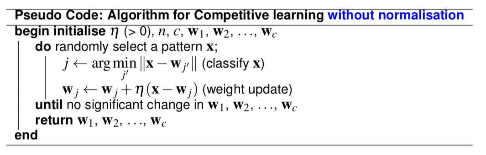
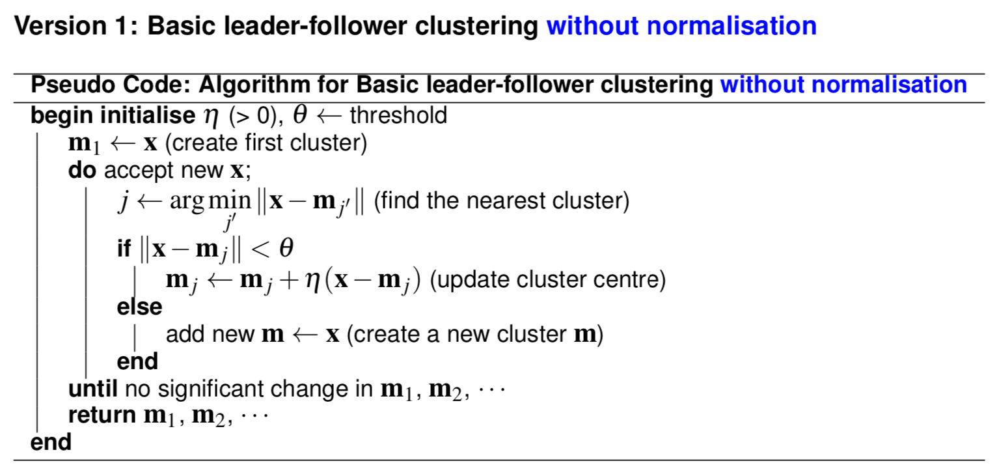

# Unsupervised Learning & Clustering

## Introduction

## Unsupervised Learning

## Clustering

### K-Means Clustering

### Fuzzy K-Means Clustering

### Hierarchical Clustering

#### Agglomerative Hierarchical Clustering

### Competitive Learniing

**Competitive learning** is related to decision-directed versions of K-means based on neural network learning rules.

### Clustering for Unknown Number o Clusters

#### Basic Leader-follower Clustering

### Dimension Reduction