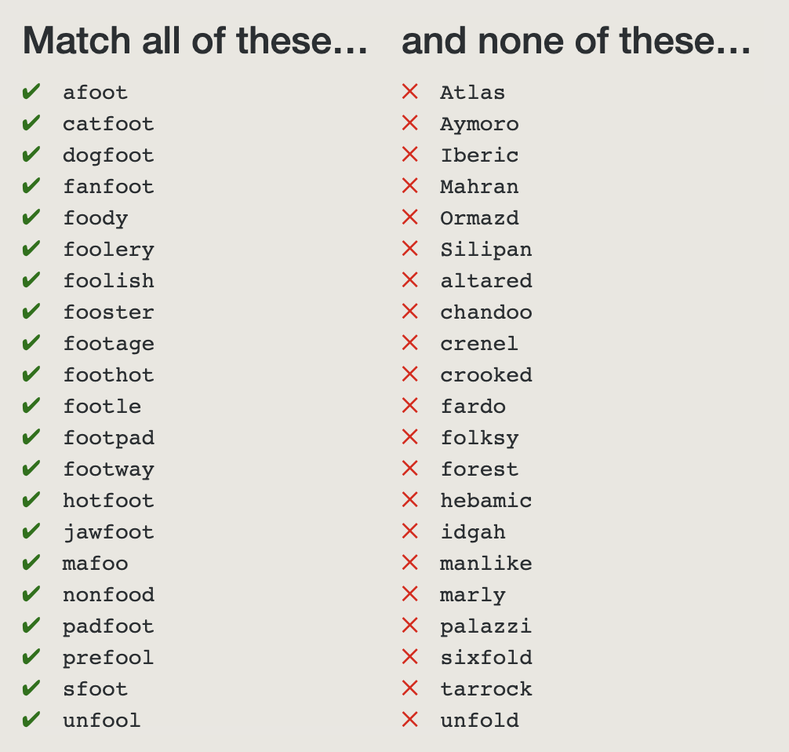
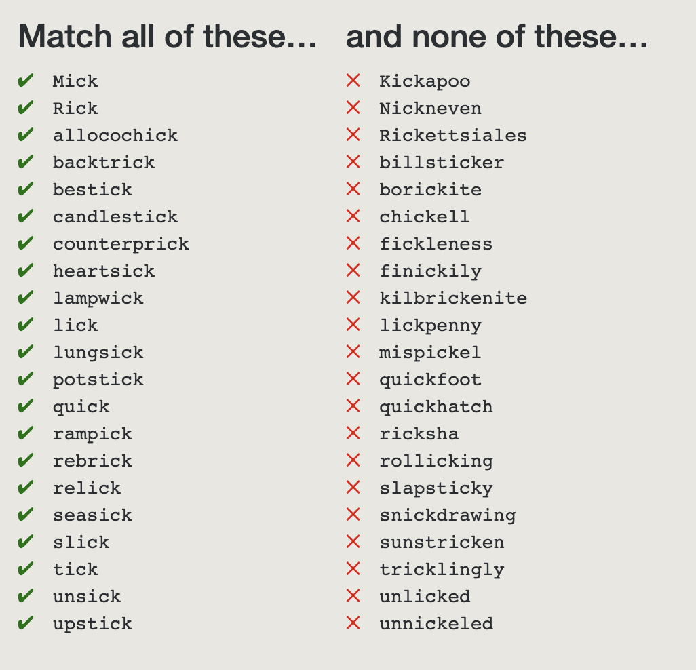
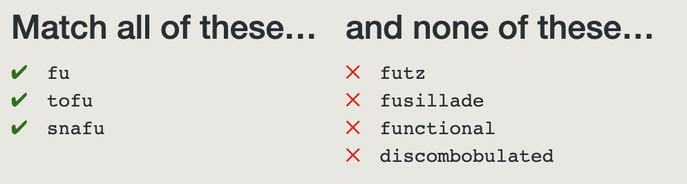
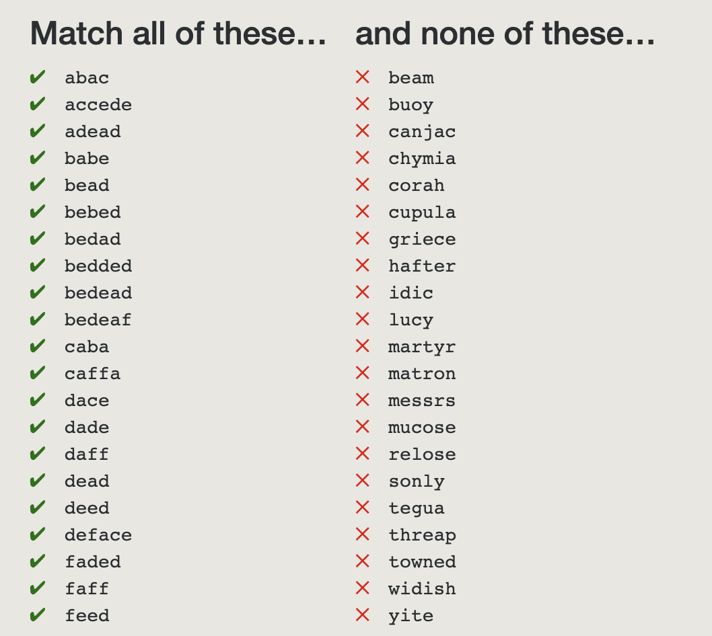

# Regex Golf

[Regex Golf](https://alf.nu/RegexGolf#)

[正则表达式教程](http://www.runoob.com/regexp/regexp-tutorial.html)

## 1. Warmup



### 答案：

```bash
.*foo.*
```

### 解析

要匹配字符串foo

## 2. Anchors – You are deducted one point per character you use, and ten if you match something you shouldn't.



### 答案：

```bash
.*ck$
```

### 解析

Regex定位符

## 3. It never ends – $ not allowed



### 答案

```bash
fu\b
```

### 解析

Regex定位符

## 4. Ranges – The test vectors were generated by grepping /usr/dict/words. Can you tell?



### 答案：

```bash
fu\b
```

### 解析

Regex定位符